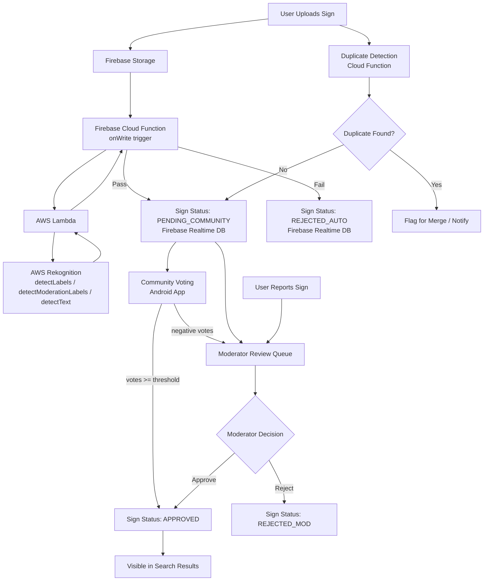
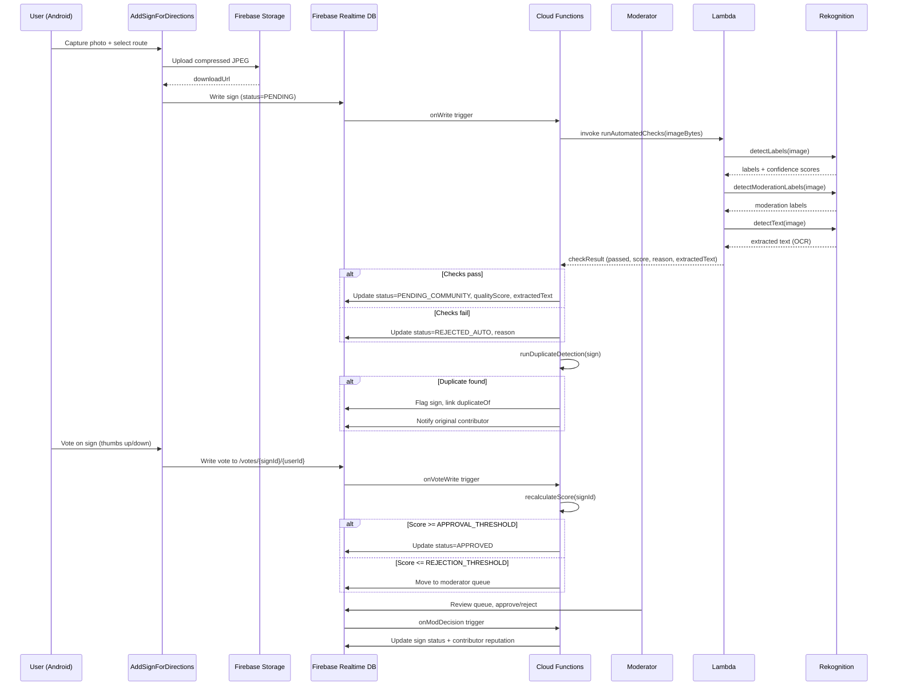
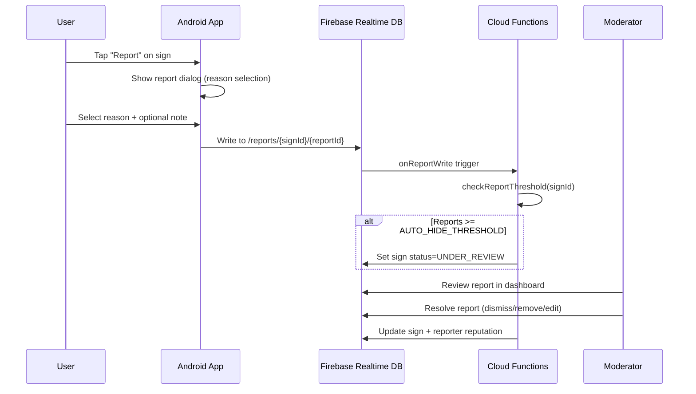

# Design Document: Content Moderation System

## Overview

The Content Moderation System introduces a multi-layered quality control pipeline for TakeMe Mobile's crowdsourced taxi sign database. It combines automated image quality checks, community voting, moderator review, duplicate detection, contributor reputation scoring, and a reporting system to ensure the sign database remains accurate, relevant, and high-quality for South African commuters.

This system is designed to integrate with the existing Firebase-backed, Activity-based Android architecture (Phase 1) while laying the groundwork for the MVVM migration planned in Phase 2. All new moderation data lives in Firebase Realtime Database under dedicated top-level nodes, and moderation logic that cannot run on-device is handled via Firebase Cloud Functions.

## Architecture




## Sequence Diagrams

### Sign Upload & Moderation Pipeline



### Content Reporting Flow




## Components and Interfaces

### Component 1: ModerationRepository

**Purpose**: Single data-access point for all moderation-related Firebase reads/writes on the Android client. Abstracts DB paths from Activities/ViewModels.

**Interface**:
```java
interface ModerationRepository {
    void submitVote(String signId, String userId, VoteType vote, OnCompleteListener<Void> callback);
    void submitReport(String signId, Report report, OnCompleteListener<Void> callback);
    void fetchModerationQueue(ValueEventListener listener);
    void moderateSign(String signId, ModerationDecision decision, String moderatorUid, OnCompleteListener<Void> callback);
    void fetchContributorReputation(String userId, ValueEventListener listener);
    void fetchSignWithStatus(String destination, String from, ValueEventListener listener);
}
```

**Responsibilities**:
- Encapsulate all `/moderation`, `/votes`, `/reports`, `/reputation` DB paths
- Enforce that only approved signs are returned to search queries
- Provide moderator-only write paths (enforced by Firebase security rules)

---

### Component 2: VotingView (DisplaySignActivity extension)

**Purpose**: Adds thumbs-up/thumbs-down voting UI to the existing sign display screen.

**Interface**:
```java
interface VotingView {
    void showVotingControls(String signId, boolean userHasVoted);
    void onVoteSubmitted(VoteType vote);
    void showVoteCount(int upvotes, int downvotes);
}
```

**Responsibilities**:
- Render vote buttons only for PENDING_COMMUNITY signs
- Prevent duplicate votes per user per sign
- Show current vote tally

---

### Component 3: ReportDialog

**Purpose**: Bottom-sheet dialog allowing users to report a sign with a reason.

**Interface**:
```java
interface ReportDialog {
    void show(String signId, FragmentManager fm);
    void onReportSubmitted(Report report);
}
```

**Responsibilities**:
- Present reason options: INAPPROPRIATE, INCORRECT_INFO, DUPLICATE, POOR_QUALITY
- Capture optional free-text note (max 200 chars)
- Submit report via ModerationRepository

---

### Component 4: ModeratorDashboardActivity

**Purpose**: New Activity for moderators to review the queue, approve/reject signs, and resolve reports.

**Interface**:
```java
// Launched only when user has moderator role claim in Firebase Auth custom claims
class ModeratorDashboardActivity extends AppCompatActivity {
    void loadPendingQueue();
    void onSignApproved(String signId);
    void onSignRejected(String signId, String reason);
    void onReportResolved(String reportId, ReportResolution resolution);
}
```

**Responsibilities**:
- Display paginated list of signs awaiting review
- Show sign image, route, reporter notes, vote counts
- Allow approve/reject with optional reason
- Show open reports grouped by sign

---

### Component 5: DuplicateDetectionFunction (Firebase Cloud Function)

**Purpose**: Server-side function triggered on new sign write to detect duplicates using route matching and perceptual hash comparison. pHash computation is performed in AWS Lambda (which already has the image bytes from the quality check step), then stored on the sign node for subsequent comparisons.

**Interface**:
```pascal
PROCEDURE detectDuplicates(newSign)
  INPUT: newSign (signId, fromName, destinationName, downloadUrl, pHash)
  OUTPUT: duplicateResult (isDuplicate, existingSignId, confidence)
```

**Responsibilities**:
- Exact route match check (same from + destination, case-insensitive)
- Perceptual hash (pHash) similarity check against existing approved signs on same route (pHash computed in Lambda, not by Rekognition)
- Flag sign and link `duplicateOf` field if confidence > threshold
- Notify original contributor via FCM

---

### Component 6: ReputationEngine (Firebase Cloud Function)

**Purpose**: Calculates and updates contributor reputation scores based on moderation outcomes.

**Interface**:
```pascal
PROCEDURE updateReputation(userId, event)
  INPUT: userId (String), event (ReputationEvent)
  OUTPUT: newScore (Integer)
```

**Responsibilities**:
- Award/deduct points based on sign approval, rejection, reports received
- Compute reputation tier (NEW, TRUSTED, VETERAN, MODERATOR_CANDIDATE)
- Persist score to `/reputation/{userId}`


## Data Models

### Extended Sign Model

The existing `/signs/{DESTINATION}/{auto-id}` node gains new fields:

```java
// Extends existing Sign.java
public class Sign implements Serializable {
    // --- Existing fields ---
    Place destination;
    String downloadUrl;
    Place from;
    String userUID;
    String price;

    // --- New moderation fields ---
    String status;          // PENDING | PENDING_COMMUNITY | APPROVED | REJECTED_AUTO | REJECTED_MOD | UNDER_REVIEW
    String rejectionReason; // nullable; set on rejection
    String duplicateOf;     // nullable; signId of canonical sign
    long uploadedAt;        // epoch millis
    long moderatedAt;       // epoch millis; nullable
    String moderatedBy;     // moderator UID; nullable
    String pHash;           // perceptual hash of image; set by Cloud Function
    float qualityScore;     // 0.0–1.0; set by automated check Cloud Function
    String extractedText;   // nullable; OCR output from Rekognition.detectText(); foundation for Phase 3 route auto-detection
}
```

**Validation Rules**:
- `status` must be one of the defined enum values
- `qualityScore` in range [0.0, 1.0]
- `uploadedAt` must be set on creation (server timestamp)
- Signs with `status != APPROVED` must not appear in user-facing search results

---

### Vote Model

Firebase path: `/votes/{signId}/{userId}`

```java
public class Vote {
    String userId;
    String signId;
    String voteType;   // UP | DOWN
    long votedAt;      // epoch millis
}
```

**Validation Rules**:
- One vote per user per sign (enforced by path structure: userId is the key)
- `voteType` must be UP or DOWN

---

### VoteSummary Model

Firebase path: `/voteSummaries/{signId}` (maintained by Cloud Function)

```java
public class VoteSummary {
    String signId;
    int upvotes;
    int downvotes;
    float score;       // upvotes / (upvotes + downvotes); NaN-safe
    long lastUpdated;
}
```

---

### Report Model

Firebase path: `/reports/{signId}/{reportId}`

```java
public class Report {
    String reportId;       // auto-generated push key
    String signId;
    String reporterUid;
    String reason;         // INAPPROPRIATE | INCORRECT_INFO | DUPLICATE | POOR_QUALITY
    String note;           // optional, max 200 chars
    String status;         // OPEN | RESOLVED_DISMISSED | RESOLVED_REMOVED | RESOLVED_EDITED
    long reportedAt;
    long resolvedAt;       // nullable
    String resolvedBy;     // moderator UID; nullable
}
```

**Validation Rules**:
- `reason` must be one of the four defined values
- `note` max 200 characters
- One report per user per sign per reason (prevent spam)

---

### Reputation Model

Firebase path: `/reputation/{userId}`

```java
public class Reputation {
    String userId;
    int score;             // cumulative points
    String tier;           // NEW | TRUSTED | VETERAN | MODERATOR_CANDIDATE
    int signsApproved;
    int signsRejected;
    int reportsReceived;   // valid reports against user's signs
    long lastUpdated;
}
```

**Tier Thresholds**:
- NEW: score < 50
- TRUSTED: 50 <= score < 200
- VETERAN: 200 <= score < 500
- MODERATOR_CANDIDATE: score >= 500

---

### ModerationQueueEntry Model

Firebase path: `/moderationQueue/{signId}`

```java
public class ModerationQueueEntry {
    String signId;
    String destination;
    String from;
    String downloadUrl;
    String reason;         // AUTO_FLAGGED | COMMUNITY_FLAGGED | REPORTED
    int reportCount;
    float qualityScore;
    long queuedAt;
    String priority;       // HIGH | MEDIUM | LOW
}
```


## Algorithmic Pseudocode

### Algorithm 1: Automated Quality Check (AWS Lambda + Rekognition)

The Firebase Cloud Function downloads the image from Firebase Storage and invokes an AWS Lambda function, passing the image bytes. Lambda calls three Rekognition APIs and returns a consolidated result. The Cloud Function writes the result back to Firebase Realtime DB.

```pascal
ALGORITHM runAutomatedQualityCheck(sign)
INPUT: sign (signId, downloadUrl, fromName, destinationName)
OUTPUT: checkResult (passed: Boolean, score: Float, reason: String, extractedText: String)

BEGIN
  ASSERT sign.downloadUrl IS NOT NULL AND NOT EMPTY
  ASSERT sign.fromName IS NOT NULL AND NOT EMPTY
  ASSERT sign.destinationName IS NOT NULL AND NOT EMPTY

  imageBytes ← downloadImage(sign.downloadUrl)

  IF imageBytes IS NULL THEN
    RETURN { passed: false, score: 0.0, reason: "IMAGE_DOWNLOAD_FAILED", extractedText: null }
  END IF

  // Check 1: Content moderation — auto-reject inappropriate content
  moderationResult ← Rekognition.detectModerationLabels({
    Image: { Bytes: imageBytes },
    MinConfidence: MODERATION_CONFIDENCE_THRESHOLD
  })

  IF moderationResult.ModerationLabels IS NOT EMPTY THEN
    RETURN { passed: false, score: 0.0, reason: "INAPPROPRIATE_CONTENT", extractedText: null }
  END IF

  // Check 2: Content relevance — verify image contains a sign or vehicle
  labelsResult ← Rekognition.detectLabels({
    Image: { Bytes: imageBytes },
    MaxLabels: 20,
    MinConfidence: LABEL_CONFIDENCE_THRESHOLD
  })

  relevantLabels ← FILTER labelsResult.Labels WHERE label.Name IN
    ["Sign", "Text", "Vehicle", "Car", "Taxi", "Bus", "Road", "Street", "Transportation"]

  IF relevantLabels IS EMPTY THEN
    RETURN { passed: false, score: 0.1, reason: "NOT_RELEVANT_CONTENT", extractedText: null }
  END IF

  // Check 3: OCR — extract text from taxi sign (foundation for Phase 3 route auto-detection)
  textResult ← Rekognition.detectText({
    Image: { Bytes: imageBytes }
  })

  extractedText ← JOIN (textResult.TextDetections
    WHERE detection.Type == "LINE"
    ORDER BY detection.Confidence DESC
    LIMIT 5) WITH newline separator

  // Composite quality score derived from Rekognition confidence scores
  topLabelConfidence ← MAX(relevantLabels[*].Confidence) / 100.0
  labelCoverage ← MIN(relevantLabels.count / EXPECTED_LABEL_COUNT, 1.0)
  score ← (topLabelConfidence * 0.7) + (labelCoverage * 0.3)
  score ← clamp(score, 0.0, 1.0)

  IF score < MIN_QUALITY_SCORE THEN
    RETURN { passed: false, score: score, reason: "LOW_QUALITY_SCORE", extractedText: extractedText }
  END IF

  RETURN { passed: true, score: score, reason: null, extractedText: extractedText }
END
```

**Preconditions**:
- `sign.downloadUrl` is a valid, accessible Firebase Storage URL
- Image is JPEG or PNG format (Rekognition supports both; storage rules enforce JPEG)
- AWS Lambda has IAM permissions for `rekognition:DetectLabels`, `rekognition:DetectModerationLabels`, `rekognition:DetectText`

**Postconditions**:
- `extractedText` (nullable) is written to the sign's DB node as `sign.extractedText`
- Returns a deterministic result for the same image input and Rekognition model version
- `score` is always in [0.0, 1.0]
- `pHash` is still computed separately by the duplicate detection step (Rekognition does not provide pHash)

**Constants**:
- MODERATION_CONFIDENCE_THRESHOLD = 60 (Rekognition confidence %, reject if any moderation label exceeds this)
- LABEL_CONFIDENCE_THRESHOLD = 70 (minimum confidence % for a label to be considered)
- EXPECTED_LABEL_COUNT = 3 (normalisation denominator for label coverage score)
- MIN_QUALITY_SCORE = 0.30 (minimum composite score to pass)

---

### Algorithm 2: Duplicate Detection (Cloud Function)

```pascal
ALGORITHM detectDuplicates(newSign)
INPUT: newSign (signId, fromName, destinationName, pHash)
OUTPUT: duplicateResult (isDuplicate: Boolean, existingSignId: String, confidence: Float)

BEGIN
  ASSERT newSign.pHash IS NOT NULL

  // Step 1: Fetch all APPROVED signs on the same route
  candidates ← DB.query("/signs/" + newSign.destinationName.toUpperCase())
                  .where("from.name", "==", newSign.fromName)
                  .where("status", "==", "APPROVED")

  IF candidates IS EMPTY THEN
    RETURN { isDuplicate: false, existingSignId: null, confidence: 0.0 }
  END IF

  bestMatch ← null
  bestConfidence ← 0.0

  FOR each candidate IN candidates DO
    ASSERT candidate.pHash IS NOT NULL

    hammingDist ← computeHammingDistance(newSign.pHash, candidate.pHash)
    similarity ← 1.0 - (hammingDist / PHASH_BIT_LENGTH)

    IF similarity > bestConfidence THEN
      bestConfidence ← similarity
      bestMatch ← candidate
    END IF
  END FOR

  // Loop invariant: bestConfidence is the highest similarity seen so far

  IF bestConfidence >= DUPLICATE_THRESHOLD THEN
    RETURN { isDuplicate: true, existingSignId: bestMatch.signId, confidence: bestConfidence }
  ELSE
    RETURN { isDuplicate: false, existingSignId: null, confidence: bestConfidence }
  END IF
END
```

**Preconditions**:
- `newSign.pHash` has been computed by `runAutomatedQualityCheck`
- All candidate signs have `pHash` set

**Postconditions**:
- If `isDuplicate = true`, caller sets `newSign.duplicateOf = existingSignId` and `status = DUPLICATE_PENDING`
- `confidence` is always in [0.0, 1.0]

**Loop Invariant**: After each iteration, `bestConfidence` holds the maximum similarity found among all candidates examined so far.

**Constants**:
- PHASH_BIT_LENGTH = 64
- DUPLICATE_THRESHOLD = 0.90 (90% similarity)

---

### Algorithm 3: Vote Score Calculation (Cloud Function)

```pascal
ALGORITHM recalculateVoteScore(signId)
INPUT: signId (String)
OUTPUT: updatedSummary (VoteSummary)

BEGIN
  votes ← DB.getAll("/votes/" + signId)

  upvotes ← 0
  downvotes ← 0

  FOR each vote IN votes DO
    IF vote.voteType == "UP" THEN
      upvotes ← upvotes + 1
    ELSE IF vote.voteType == "DOWN" THEN
      downvotes ← downvotes + 1
    END IF
  END FOR

  // Loop invariant: upvotes + downvotes == count of votes processed so far

  total ← upvotes + downvotes
  score ← IF total > 0 THEN upvotes / total ELSE 0.0

  summary ← { signId, upvotes, downvotes, score, lastUpdated: now() }
  DB.set("/voteSummaries/" + signId, summary)

  // Determine if status should change
  sign ← DB.get("/signs/.../signId")

  IF total >= MIN_VOTES_FOR_DECISION THEN
    IF score >= APPROVAL_SCORE_THRESHOLD THEN
      DB.update(sign.path, { status: "APPROVED" })
      updateReputation(sign.userUID, REPUTATION_EVENT_APPROVED)
    ELSE IF score <= REJECTION_SCORE_THRESHOLD THEN
      DB.update(sign.path, { status: "PENDING_MODERATOR" })
      addToModerationQueue(signId, "COMMUNITY_FLAGGED")
    END IF
  END IF

  RETURN summary
END
```

**Preconditions**:
- `signId` exists in the database
- Sign status is PENDING_COMMUNITY

**Postconditions**:
- `/voteSummaries/{signId}` is updated atomically
- Sign status transitions are idempotent

**Loop Invariant**: `upvotes + downvotes` equals the number of votes iterated so far.

**Constants**:
- MIN_VOTES_FOR_DECISION = 5
- APPROVAL_SCORE_THRESHOLD = 0.70 (70% upvotes)
- REJECTION_SCORE_THRESHOLD = 0.30 (30% or fewer upvotes)

---

### Algorithm 4: Reputation Update (Cloud Function)

```pascal
ALGORITHM updateReputation(userId, event)
INPUT: userId (String), event (ReputationEvent)
OUTPUT: newScore (Integer)

REPUTATION_DELTA_MAP ← {
  SIGN_APPROVED:    +10,
  SIGN_REJECTED:    -5,
  SIGN_REPORTED:    -3,
  REPORT_VALID:     +2,
  REPORT_DISMISSED: -1
}

BEGIN
  ASSERT userId IS NOT NULL AND NOT EMPTY
  ASSERT event IN REPUTATION_DELTA_MAP.keys()

  current ← DB.get("/reputation/" + userId)

  IF current IS NULL THEN
    current ← { userId, score: 0, tier: "NEW", signsApproved: 0, signsRejected: 0, reportsReceived: 0 }
  END IF

  delta ← REPUTATION_DELTA_MAP[event]
  newScore ← MAX(0, current.score + delta)

  // Update counters
  IF event == SIGN_APPROVED THEN current.signsApproved ← current.signsApproved + 1 END IF
  IF event == SIGN_REJECTED THEN current.signsRejected ← current.signsRejected + 1 END IF
  IF event == SIGN_REPORTED THEN current.reportsReceived ← current.reportsReceived + 1 END IF

  newTier ← computeTier(newScore)

  DB.set("/reputation/" + userId, {
    ...current,
    score: newScore,
    tier: newTier,
    lastUpdated: now()
  })

  RETURN newScore
END

PROCEDURE computeTier(score)
  IF score >= 500 THEN RETURN "MODERATOR_CANDIDATE"
  ELSE IF score >= 200 THEN RETURN "VETERAN"
  ELSE IF score >= 50 THEN RETURN "TRUSTED"
  ELSE RETURN "NEW"
  END IF
END PROCEDURE
```

**Preconditions**:
- `userId` corresponds to a valid Firebase Auth UID
- `event` is a known ReputationEvent value

**Postconditions**:
- Score never goes below 0
- Tier is always consistent with score
- Update is atomic (single DB.set call)


## Key Functions with Formal Specifications

### ModerationRepository.submitVote()

```java
void submitVote(String signId, String userId, VoteType vote, OnCompleteListener<Void> callback)
```

**Preconditions**:
- `signId` is non-null and refers to an existing sign with status `PENDING_COMMUNITY`
- `userId` is non-null and matches the authenticated user's UID
- `vote` is either `VoteType.UP` or `VoteType.DOWN`
- User has not previously voted on this sign (checked client-side; enforced server-side by path structure)

**Postconditions**:
- A Vote node is written to `/votes/{signId}/{userId}`
- The Cloud Function `recalculateVoteScore` is triggered
- `callback.onComplete` is called with success or failure Task
- No mutation to the sign node directly from this method

---

### ModerationRepository.submitReport()

```java
void submitReport(String signId, Report report, OnCompleteListener<Void> callback)
```

**Preconditions**:
- `signId` is non-null and refers to an existing sign
- `report.reason` is one of: INAPPROPRIATE, INCORRECT_INFO, DUPLICATE, POOR_QUALITY
- `report.note` is null or length <= 200
- `report.reporterUid` matches the authenticated user's UID

**Postconditions**:
- Report is written to `/reports/{signId}/{push-id}`
- Cloud Function checks report threshold and may update sign status to `UNDER_REVIEW`
- `callback.onComplete` is called

---

### ModerationRepository.moderateSign()

```java
void moderateSign(String signId, ModerationDecision decision, String moderatorUid, OnCompleteListener<Void> callback)
```

**Preconditions**:
- Caller has `moderator: true` custom claim in Firebase Auth token
- `signId` refers to a sign in `PENDING_MODERATOR` or `UNDER_REVIEW` status
- `decision` is `APPROVE` or `REJECT`
- `moderatorUid` is non-null

**Postconditions**:
- Sign status updated to `APPROVED` or `REJECTED_MOD`
- `moderatedBy` and `moderatedAt` fields set on sign
- Reputation update triggered for sign contributor
- Sign removed from `/moderationQueue/{signId}`

---

### DisplaySignActivity (modified): fetchApprovedSign()

```java
// Modified query in DisplaySignActivity to filter by status
Sign fetchApprovedSign(String from, String destination, DataSnapshot dataSnapshot)
```

**Preconditions**:
- `from` and `destination` are non-null, non-empty strings
- `dataSnapshot` is a valid snapshot of `/signs/{DESTINATION}`

**Postconditions**:
- Returns only a Sign where `status == "APPROVED"`
- Returns null if no approved sign found for the route
- Does not return PENDING, REJECTED, or UNDER_REVIEW signs to end users

**Loop Invariant**: All previously examined children that did not match the from/destination or were not APPROVED have been skipped.


## Example Usage

### Voting on a Sign (Android Java)

```java
// In DisplaySignActivity, after sign is loaded and status == PENDING_COMMUNITY
ModerationRepository repo = new ModerationRepositoryImpl();
String signId = currentSign.getSignId();
String userId = FirebaseAuth.getInstance().getCurrentUser().getUid();

thumbsUpButton.setOnClickListener(v -> {
    repo.submitVote(signId, userId, VoteType.UP, task -> {
        if (task.isSuccessful()) {
            showVoteFeedback("Thanks for voting!");
        } else {
            showError("Vote failed, please try again.");
        }
    });
});
```

### Reporting a Sign (Android Java)

```java
// User taps report icon on DisplaySignActivity
ReportDialog dialog = new ReportDialog(signId, repo);
dialog.show(getSupportFragmentManager(), "report_dialog");

// ReportDialog internally calls:
Report report = new Report();
report.setSignId(signId);
report.setReporterUid(currentUser.getUid());
report.setReason(selectedReason);   // e.g. "INCORRECT_INFO"
report.setNote(optionalNote);
report.setReportedAt(System.currentTimeMillis());

repo.submitReport(signId, report, task -> {
    if (task.isSuccessful()) {
        Toast.makeText(context, "Report submitted. Thank you.", Toast.LENGTH_SHORT).show();
    }
});
```

### Moderator Approving a Sign (Android Java)

```java
// In ModeratorDashboardActivity
repo.moderateSign(signId, ModerationDecision.APPROVE, moderatorUid, task -> {
    if (task.isSuccessful()) {
        adapter.removeItem(signId);
        showSnackbar("Sign approved.");
    }
});
```

### Filtering Approved Signs in Search (Modified DisplaySignActivity)

```java
// Modified getSign() to respect moderation status
private Sign getSign(String from, String destination, DataSnapshot dataSnapshot) {
    for (DataSnapshot d : dataSnapshot.child(destination.toUpperCase()).getChildren()) {
        String status = d.child("status").getValue(String.class);
        // Only show approved signs to end users
        if (!"APPROVED".equals(status)) continue;

        HashMap fm = (HashMap) d.child("from").getValue();
        if (from.equalsIgnoreCase(fm.get("name").toString())) {
            Sign sign = new Sign();
            sign.setDownloadUrl(d.child("downloadUrl").getValue(String.class));
            sign.setPrice(d.child("price").getValue(String.class));
            return sign;
        }
    }
    return null;
}
```


## Correctness Properties

1. **Status Monotonicity**: A sign's status only transitions forward through the defined state machine. It never moves from APPROVED back to PENDING without an explicit moderator action.

2. **Vote Uniqueness**: For all signs S and users U, there exists at most one vote record at `/votes/{S.id}/{U.id}`. Duplicate votes are structurally impossible due to the keyed path.

3. **Search Purity**: For all signs returned by `fetchApprovedSign()`, `sign.status == "APPROVED"`. No PENDING, REJECTED, or UNDER_REVIEW sign is ever surfaced to end-user search results.

4. **Score Bounds**: For all VoteSummary records, `0.0 <= score <= 1.0` and `score == upvotes / (upvotes + downvotes)` when `total > 0`, else `score == 0.0`.

5. **Reputation Non-Negativity**: For all users U, `reputation.score >= 0`. The score can never go below zero regardless of negative events.

6. **Tier Consistency**: For all users U, `reputation.tier` is always the correct tier for `reputation.score` as defined by the tier thresholds.

7. **Duplicate Integrity**: If `sign.duplicateOf != null`, then the referenced sign exists and has `status == "APPROVED"`.

8. **Report Threshold Safety**: If `reportCount(signId) >= AUTO_HIDE_THRESHOLD`, then `sign.status` is either `UNDER_REVIEW`, `REJECTED_MOD`, or `APPROVED` (i.e., it has been reviewed). A sign with many reports is never silently left as APPROVED without moderator review.

9. **Moderator Authorization**: Only users with `moderator: true` custom claim can write to `/moderationQueue` or update sign status to `APPROVED`/`REJECTED_MOD`. This is enforced by Firebase security rules, not just client-side checks.

10. **Quality Score Determinism**: For the same image input and the same AWS Rekognition model version, `runAutomatedQualityCheck` always returns the same `score` and `passed` result. Note: Rekognition confidence scores may change across model version updates, which could cause a previously passing image to score differently after an AWS-side model update. The `qualityScore` stored on the sign reflects the score at the time of upload.


## OCR Output (Phase 3 Foundation)

`Rekognition.detectText()` is called during the automated quality check for every uploaded sign. The extracted text lines are concatenated and stored as `sign.extractedText` (nullable String) in Firebase Realtime DB.

This field is **informational only** in Phase 2:
- It does not affect moderation decisions (a sign with no extracted text is not penalised)
- It is not displayed in the Android app in Phase 2
- It is not used in any scoring or ranking logic

Its purpose is to pre-populate structured text data for Phase 3's automatic route detection feature, where the app will attempt to infer the taxi's destination from the sign text without requiring the user to manually enter the route.

The `extractedText` field is included in the `ModerationQueueEntry` so moderators can see the OCR output as a quality signal during manual review.


## Error Handling

### Error Scenario 1: Automated Quality Check Failure

**Condition A — Image download failure**: Cloud Function cannot download image from Firebase Storage (deleted, permission error, network timeout).
**Response**: Sign status set to `REJECTED_AUTO` with reason `IMAGE_DOWNLOAD_FAILED`. Contributor notified via FCM.
**Recovery**: Contributor can re-upload the sign.

**Condition B — Rekognition service unavailable**: AWS Rekognition returns a service error or Lambda invocation times out.
**Response**: Sign status set to `REJECTED_AUTO` with reason `REKOGNITION_SERVICE_ERROR`. The Lambda invocation is retried up to 3 times with exponential backoff before the failure is recorded.
**Recovery**: Contributor can re-upload. The Cloud Function logs the AWS error for ops visibility.

**Condition C — Unsupported image format**: Rekognition rejects the image (e.g., corrupt JPEG, unsupported encoding).
**Response**: Sign status set to `REJECTED_AUTO` with reason `IMAGE_FORMAT_NOT_SUPPORTED`. Contributor notified with guidance to re-capture the photo.
**Recovery**: Contributor re-uploads a valid image.

**Condition D — Ambiguous Rekognition result**: All Rekognition confidence scores fall below threshold (image is valid but content is unclear).
**Response**: Sign is not auto-rejected. It proceeds to `PENDING_COMMUNITY` with a low `qualityScore`. Community voting and moderator review act as the fallback quality gate.
**Recovery**: No action required; the normal moderation pipeline handles it.

---

### Error Scenario 2: Vote Submission Failure

**Condition**: Network error or Firebase write failure when submitting a vote.
**Response**: `OnCompleteListener` receives a failed Task. Android client shows a Snackbar error and re-enables the vote button.
**Recovery**: User can retry. Vote state is not partially written (atomic single-path write).

---

### Error Scenario 3: Duplicate Detection Timeout

**Condition**: Cloud Function times out before completing pHash comparison (large candidate set).
**Response**: Sign proceeds to `PENDING_COMMUNITY` without duplicate check. A retry Cloud Function is scheduled.
**Recovery**: Duplicate check runs asynchronously on retry. If duplicate found later, sign is flagged and moved to moderator queue rather than auto-rejected.

---

### Error Scenario 4: Moderator Queue Overflow

**Condition**: Moderation queue exceeds 500 items (moderator capacity exceeded).
**Response**: New signs that would enter the queue are held in `PENDING_COMMUNITY` longer (threshold for community auto-approval is lowered temporarily). Alert sent to admin via Firebase Remote Config flag.
**Recovery**: Admin assigns additional moderators or adjusts thresholds via Remote Config.

---

### Error Scenario 5: Report Spam

**Condition**: A single user submits multiple reports on the same sign.
**Response**: Firebase security rules enforce one report per user per sign per reason. Subsequent attempts are rejected with PERMISSION_DENIED.
**Recovery**: No action needed; rule enforcement is automatic.

---

### Error Scenario 6: Backward Compatibility (Existing Signs Without Status)

**Condition**: Existing signs in the database (uploaded before moderation system) have no `status` field.
**Response**: `fetchApprovedSign()` treats a null/missing `status` as `APPROVED` to preserve backward compatibility and avoid breaking existing search results.
**Recovery**: A one-time migration Cloud Function backfills `status = "APPROVED"` on all existing signs.


## Testing Strategy

### Unit Testing Approach

Test business logic in isolation using JUnit 4 (existing test setup).

Key unit test cases:
- `VoteScoreCalculator`: given N up/down votes, assert correct score and tier transition
- `ReputationEngine`: assert score deltas, non-negativity, and tier computation for all event types
- `DuplicateDetector`: assert Hamming distance calculation and threshold boundary conditions
- `QualityChecker`: assert blur/brightness scoring with mock image data
- `ModerationStateMachine`: assert all valid and invalid status transitions

---

### Property-Based Testing Approach

**Property Test Library**: JUnit 4 + [junit-quickcheck](https://github.com/pholser/junit-quickcheck) (Java property-based testing)

Key properties to test:
- For any list of votes, `score` is always in [0.0, 1.0]
- For any sequence of reputation events, `score` never goes below 0
- For any two identical images, `hammingDistance(pHash1, pHash2) == 0`
- For any two completely different images, `hammingDistance < PHASH_BIT_LENGTH`
- `computeTier(score)` is consistent with tier thresholds for all integer scores in [0, 1000]

---

### Integration Testing Approach

Using Firebase Emulator Suite (Auth, Realtime Database, Cloud Functions):

- End-to-end sign upload → quality check → status update flow
- Vote submission → score recalculation → status transition
- Report submission → threshold check → queue entry
- Moderator approve/reject → reputation update
- Security rules: verify non-moderators cannot write to moderation paths
- Backward compatibility: existing signs without `status` field still appear in search

---

### Android UI Testing (Espresso)

- Voting buttons appear only for `PENDING_COMMUNITY` signs
- Report dialog shows correct reason options and submits correctly
- Moderator dashboard is inaccessible to non-moderator users (redirects to main)
- Search results do not show non-APPROVED signs


## Performance Considerations

- **Voting reads**: `/voteSummaries/{signId}` is a single-node read, not a full scan of `/votes/{signId}`. The Cloud Function maintains this summary so the Android client never needs to count votes itself.
- **Duplicate detection**: pHash comparison is O(n) over approved signs on the same route. For typical routes this is a small set (<50 signs). If a route grows large, a secondary index on pHash prefix can be added.
- **Moderation queue**: Paginated reads using Firebase `limitToFirst(20)` with cursor-based pagination to avoid loading the full queue on the moderator dashboard.
- **Search filter**: The `status` field is added to the existing Firebase index on `destination/name` and `from/name` to avoid full-node scans. The `.indexOn` rule is updated to include `status`.
- **Image quality check**: Runs server-side in Cloud Functions, not on-device, to avoid battery/CPU impact on the Android client.
- **Backward compatibility migration**: The one-time backfill function runs in batches of 100 signs with 100ms delays to avoid Firebase write rate limits.

## Security Considerations

- **Moderator role**: Assigned via Firebase Auth custom claims (`moderator: true`). Claims are set server-side only (Cloud Function or Admin SDK). The Android client reads the claim from the ID token but cannot set it.
- **Vote integrity**: Firebase security rules enforce that `/votes/{signId}/{userId}` can only be written by the authenticated user matching `userId`. Users cannot vote on behalf of others.
- **Report spam prevention**: Security rules enforce one report per user per sign per reason using the path structure `/reports/{signId}/{userId}_{reason}`.
- **Moderation write protection**: Only users with `moderator: true` claim can write to `/moderationQueue` or update `status` to `APPROVED`/`REJECTED_MOD` on signs.
- **POPIA compliance**: Reports and votes contain user UIDs. These are not exposed to other users. Moderators see UIDs only in the dashboard. A data deletion Cloud Function supports right-to-erasure requests by removing all `/votes/{*}/{userId}` and `/reports/{*}/{userId}` nodes.
- **Existing security rules preserved**: The existing rule requiring `email_verified == true` for sign uploads is unchanged.

## Dependencies

### New Android Dependencies
```gradle
// No new third-party dependencies required.
// Moderation UI uses existing Material Components (BottomSheetDialogFragment for ReportDialog).
// RecyclerView already available via AndroidX for ModeratorDashboardActivity.
```

### New Firebase Services
- **Firebase Cloud Functions** (Node.js): Quality check orchestration (invokes AWS Lambda), duplicate detection, vote scoring, reputation engine, migration backfill
- **Firebase Cloud Messaging (FCM)**: Notify contributors of sign approval/rejection/duplicate detection
- **Firebase Remote Config**: Tunable thresholds (APPROVAL_SCORE_THRESHOLD, MIN_VOTES_FOR_DECISION, AUTO_HIDE_THRESHOLD) without app update

### New AWS Services
- **AWS Lambda** (Node.js runtime): Executes image analysis by calling Rekognition APIs. Invoked from the Firebase Cloud Function via the AWS SDK for JavaScript.
- **AWS Rekognition**: Provides `detectLabels` (content relevance), `detectModerationLabels` (inappropriate content auto-rejection), and `detectText` (OCR for extracted text / Phase 3 foundation).
- **AWS IAM**: IAM role attached to the Lambda function granting `rekognition:DetectLabels`, `rekognition:DetectModerationLabels`, and `rekognition:DetectText` permissions. A separate IAM user/role with `lambda:InvokeFunction` permission is used by the Firebase Cloud Function.
- **AWS SDK for JavaScript** (`@aws-sdk/client-lambda`, `@aws-sdk/client-rekognition`): Used in the Firebase Cloud Function to invoke Lambda, and within Lambda to call Rekognition.

### New Firebase Database Nodes
```
/votes/{signId}/{userId}
/voteSummaries/{signId}
/reports/{signId}/{reportId}
/reputation/{userId}
/moderationQueue/{signId}
```

### Updated Firebase Database Index
```json
{
  "rules": {
    "signs": {
      "$destination": {
        ".indexOn": ["destination/name", "from/name", "status"]
      }
    }
  }
}
```
