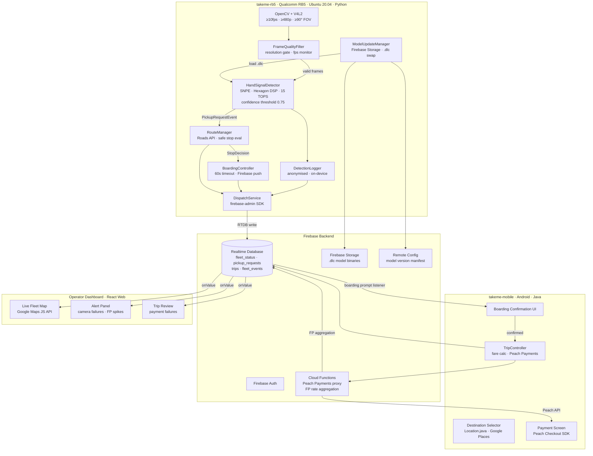

# Design Document: Driverless Taxi Hand Signal Recognition

## Overview

This feature is delivered across two separate projects that share a single Firebase backend:

- **`takeme-rb5`** — a Python service running on the Qualcomm RB5 (QRB5165) mounted in each minibus. Handles camera feed ingestion, on-device ML inference via SNPE, safe stop evaluation, and fleet telemetry publishing to Firebase.
- **`takeme-mobile`** — the existing Android app. Handles passenger boarding confirmation, destination selection, fare presentation, and payment. Unchanged in its core structure.

The split is intentional: the RB5 is the vehicle's brain (Ubuntu 20.04, Python, SNPE), while the Android app remains the passenger-facing interface. Both communicate exclusively through Firebase Realtime Database — neither project calls the other directly.

ML inference runs entirely on the RB5 (privacy requirement 8.1). No raw camera frames leave the vehicle. The existing `Location.java`, Firebase Auth, and Google Places integrations in the Android app are reused for route and destination handling on the passenger side.

---

## Project Split

| Concern | Project | Language / Runtime |
|---|---|---|
| Camera feed + ML inference | `takeme-rb5` | Python 3.11, Ubuntu 20.04 |
| Safe stop zone evaluation | `takeme-rb5` | Python 3.11 |
| Fleet telemetry publishing | `takeme-rb5` | Python 3.11, firebase-admin SDK |
| OTA model updates (receive) | `takeme-rb5` | Python 3.11, Firebase Storage |
| Passenger boarding confirmation | `takeme-mobile` | Java, Android |
| Destination selection + routing | `takeme-mobile` | Java, Android, Google Maps SDK |
| Fare calculation + payment | `takeme-mobile` | Java, Android, Peach Payments |
| Operator dashboard | separate web app | React 18, Firebase JS SDK |

---

## Tech Stack Decisions

### `takeme-rb5` — RB5 Python Project

#### Hardware: Qualcomm RB5 (QRB5165 SoC)

| Spec | Value |
|---|---|
| SoC | Qualcomm QRB5165 |
| AI Engine | 15 TOPS (Hexagon DSP + HTA + Adreno 650 GPU) |
| RAM | 16GB LPDDR5 |
| Storage | 128GB UFS 3.0 |
| Camera support | Up to 7 concurrent cameras via Spectra 480 ISP |
| OS | Ubuntu 20.04 LTS |
| Connectivity | 4G/5G via mezzanine card |
| Temp range | -30°C to +105°C (industrial grade — suitable for SA outdoor conditions) |

One RB5 unit is mounted per minibus, connected to a forward-facing camera (and optionally a side camera). The 5G mezzanine card provides the Firebase connection.

#### ML Inference: SNPE (Qualcomm Neural Processing SDK)

**Decision: SNPE 2.x with Hexagon DSP runtime**

| Option | Verdict |
|---|---|
| SNPE 2.x | **Selected** — native Qualcomm SDK, unlocks the full 15 TOPS Hexagon DSP + HTA on the QRB5165, Python bindings available, supports `.dlc` model format converted from TFLite/ONNX, lowest latency on RB5 hardware |
| TFLite Linux runtime | Rejected — runs on CPU/GPU only on Linux, cannot access the Hexagon DSP; higher latency |
| ONNX Runtime | Rejected — QNN execution provider for Hexagon is less mature than SNPE's native toolchain |

SNPE's Python bindings (`snpe-python`) allow inference to be called directly from the Python service. Models are converted from TFLite `.tflite` to SNPE `.dlc` format as part of the CI pipeline before deployment. The Hexagon DSP runtime comfortably meets the 200ms inference latency requirement (req 2.1.1).

**Key Python dependencies (`requirements.txt`):**
```
snpe-python          # Qualcomm SNPE Python bindings (installed from QDK)
numpy>=1.24
```

#### Camera Pipeline: OpenCV + V4L2

**Decision: OpenCV 4.x with V4L2 backend**

OpenCV's `VideoCapture` with the V4L2 backend provides direct Linux camera access with minimal dependencies. The RB5's Spectra 480 ISP exposes cameras as standard V4L2 devices.

- `cv2.VideoCapture('/dev/video0')` opens the forward-facing camera
- Frame rate configured to ≥10fps via `CAP_PROP_FPS`
- Resolution set to ≥480p via `CAP_PROP_FRAME_WIDTH` / `CAP_PROP_FRAME_HEIGHT`
- Frames delivered as NumPy arrays, pre-processed before SNPE inference

**Key Python dependencies:**
```
opencv-python>=4.8
```

#### Firebase Communication: firebase-admin SDK

**Decision: firebase-admin Python SDK 6.x**

The `firebase-admin` SDK provides full RTDB, Storage, and Auth access from Python, using the same Firebase project as the Android app. Service account credentials are stored securely on the RB5 and never transmitted.

**Key Python dependencies:**
```
firebase-admin>=6.3
```

#### RB5 Python Project Structure

```
takeme-rb5/
├── main.py                    # Entry point, service loop
├── requirements.txt
├── config/
│   └── service_account.json   # Firebase service account (not committed)
├── camera/
│   └── camera_feed_manager.py # OpenCV + V4L2 feed, FrameQualityFilter
├── detector/
│   ├── hand_signal_detector.py # SNPE inference, PickupRequestEvent emission
│   └── detection_logger.py    # Anonymised detection log
├── route/
│   └── route_manager.py       # Safe stop zone evaluation, Roads API
├── boarding/
│   └── boarding_controller.py # 60s boarding window, Firebase push
├── dispatch/
│   └── dispatch_service.py    # firebase-admin facade, fleet telemetry
├── model/
│   └── model_update_manager.py # OTA .dlc download from Firebase Storage
├── models/
│   └── current.dlc            # Active SNPE model file
└── tests/
    ├── test_properties.py     # Hypothesis PBT tests
    └── test_units.py          # pytest unit tests
```

#### Testing: pytest + Hypothesis (PBT)

| Layer | Tool | Rationale |
|---|---|---|
| Unit / PBT | Hypothesis 6.x | Python-native PBT library, `@given` decorator, `st.floats()` / `st.builds()` strategies, integrates with pytest |
| Unit examples | pytest 7.x | Standard Python test runner |
| Mocking | `unittest.mock` | Standard library, mock `DispatchService`, `RouteManager` |

**Key Python test dependencies:**
```
pytest>=7.4
hypothesis>=6.100
pytest-mock>=3.12
```

---

### `takeme-mobile` — Android Passenger App

#### On-Device ML Inference

The Android app no longer runs ML inference — that responsibility moves entirely to the RB5. The Android app only receives `PickupRequestEvent` data from Firebase RTDB and responds to boarding prompts.

#### Camera Pipeline: CameraX (retained for future use)

CameraX dependencies remain in `build.gradle` for potential future passenger-side features (e.g. QR code scanning for boarding). Not used for hand signal detection.

---

### Backend / Realtime Sync: Firebase Realtime Database

**Decision: Firebase Realtime Database (RTDB) — extend existing instance**

The project already uses `firebase-database:19.2.0` and `firebase-ui-database:4.0.0`. Extending
the existing RTDB is the lowest-friction path.

| Option | Verdict |
|---|---|
| Firebase RTDB | **Selected** — already integrated, sub-second push latency for fleet telemetry (req 7.1), simple JSON tree maps cleanly to `fleet_status`, `pickup_requests`, `trips`, `fleet_events` nodes |
| Firestore | Rejected for telemetry — Firestore's document model adds overhead for high-frequency position updates; its offline persistence is better suited to structured data than streaming telemetry. Firestore could be used for long-term trip archival but adds a second SDK dependency |

RTDB's `onDisconnect()` handler is used to detect vehicle disconnection (req 9.2), and
`ServerValue.TIMESTAMP` ensures consistent timestamps across devices.

---

### OTA Model Updates: Firebase Remote Config + Firebase Storage

**Decision: Firebase Remote Config for version manifest + Firebase Storage for model binaries**

Both SDKs are already present (`firebase-storage:19.1.0`). The flow:
1. Remote Config holds a JSON manifest: `{ "model_version": "v3", "model_url": "gs://..." }`
2. `ModelUpdateManager` fetches Remote Config on app start and after each trip
3. If `model_version` differs from the on-device version, download the `.tflite` from Storage
4. Atomically swap the model file and call `HandSignalDetector.loadModel(File)`
5. Log the version transition (req 10.3.2)

This satisfies req 10.3 without a Play Store update and req 10.4 because the CI pipeline runs the
accuracy gate before publishing a new Remote Config value.

---

### Payment Processing: Peach Payments

**Decision: Peach Payments (primary) with PayFast as fallback**

| Option | Verdict |
|---|---|
| Peach Payments | **Selected** — South Africa's leading payment gateway for mobile apps, supports card, EFT, and mobile wallets (SnapScan, Zapper), REST API with Android SDK, PCI-DSS compliant, supports ZAR natively |
| PayFast | Secondary — widely used in SA, good for EFT/instant EFT, but weaker mobile SDK; suitable as a fallback or for operator billing |
| Stripe | Rejected — not natively available in South Africa; requires a US/EU entity for merchant accounts; poor ZAR support |

Peach Payments' `Checkout` SDK handles the payment sheet UI. The `TripController` calls the Peach
REST API server-side (via a Firebase Cloud Function) to avoid embedding secret keys in the APK.
Payment retry logic (req 6.3) is implemented in `DispatchService` with exponential backoff up to
3 attempts.

---

### Maps / Routing: Google Maps SDK + Roads API

**Decision: Google Maps SDK for Android + Roads API**

Already integrated (`play-services-maps:17.0.0`, `places:2.1.0`, `play-services-location:17.0.0`).
Extensions needed:
- **Roads API** (`snapToRoads`, `nearestRoads`) for Safe_Stop_Zone evaluation (req 3.1) — classifies
  road segments by speed limit and geometry
- **Directions API** for optimal route calculation after destination selection (req 5.1.2)
- **Distance Matrix API** for fare distance calculation (req 6.1.1)

The existing `Location.java` `setPlace()` method is reused for destination selection in the
passenger app. `RouteManager` wraps the Roads API calls.

---

### Testing Stack

**Decision: JUnit 4 + jqwik (PBT) + Espresso + Mockito**

| Layer | Tool | Rationale |
|---|---|---|
| Unit / PBT | jqwik 1.8.x | Runs on JVM, integrates with JUnit 4 via `@RunWith(JqwikTestEngine.class)`, generates arbitrary inputs for property tests, supports `@Property` and `@Provide` annotations |
| Unit examples | JUnit 4 | Already configured in `build.gradle` (`junit:junit:4.12`) |
| Mocking | Mockito 4.x | Standard Android mocking; mock `DispatchService`, `RouteManager` in unit tests |
| UI / integration | Espresso 3.2 | Already configured; used for boarding confirmation flow and destination selection |
| Instrumented | AndroidJUnitRunner | Already configured |

**jqwik dependency:**
```groovy
testImplementation 'net.jqwik:jqwik:1.8.1'
testImplementation 'org.mockito:mockito-core:4.11.0'
```

---

### Operator Dashboard: React + Firebase RTDB

**Decision: React 18 + Firebase JS SDK (web app)**

The operator dashboard (req 7.1, 7.2, 7.3) is a separate web application, not part of the Android
APK. Recommended stack:
- **React 18** with TypeScript — component model maps well to fleet map + alert panels
- **Firebase JS SDK 10.x** — `onValue()` listener on `/fleet_status` gives real-time vehicle
  positions with no polling
- **Google Maps JavaScript API** — renders vehicle positions on a live map
- **Recharts** — for false-positive rate trend charts (req 10.2)

This is a separate repo/deployment; the Android codebase only needs to write correctly to RTDB.

---

## Architecture



---

## Components and Interfaces

### `takeme-rb5` Python Components

### 1. FrameQualityFilter

Sits between OpenCV and `HandSignalDetector`. Discards sub-480p frames and monitors fps.

```python
class FrameQualityFilter:
    def accept(self, frame: np.ndarray, width: int, height: int) -> bool:
        """Returns True if frame meets quality requirements (≥480p). Logs warning if not."""

    def record_frame_timestamp(self, timestamp_ms: int) -> None:
        """Called on each frame to track fps."""

    def get_measured_fps(self) -> float:
        """Returns measured fps over the last second."""
```

### 2. CameraFeedManager

Wraps OpenCV `VideoCapture` with V4L2 backend. Monitors feed health and fires failure callbacks.

```python
class CameraFeedManager:
    def start_feed(self, device: str, quality_filter: FrameQualityFilter,
                   detector: HandSignalDetector) -> None:
        """Opens /dev/videoN, starts frame loop at ≥10fps."""

    def stop_feed(self) -> None: ...

    def is_feed_healthy(self) -> bool: ...

    def set_failure_listener(self, listener: Callable[[int, str], None]) -> None:
        """Listener called within 500ms of feed loss (req 1.2.1). Args: timestamp_ms, vehicle_id."""
```

### 3. HandSignalDetector

Runs SNPE inference on the Hexagon DSP. Emits `PickupRequestEvent` when `confidence_score >= 0.75`.

```python
@dataclass
class DetectionResult:
    confidence_score: float          # 0.0 – 1.0
    gps_coordinates: tuple[float, float]  # (lat, lng)
    timestamp_ms: int
    outcome: str                     # "CONFIRMED_PICKUP" | "UNCONFIRMED" | "FALSE_POSITIVE"

class HandSignalDetector:
    def detect(self, frame: np.ndarray) -> DetectionResult:
        """Runs SNPE inference. Must complete within 200ms (req 2.1.1)."""

    def load_model(self, model_path: str, new_version: str) -> None:
        """Hot-swaps the .dlc model file without restarting the service (req 10.3).
        Logs previous and new model version with timestamp."""

    def get_current_model_version(self) -> str: ...

    def set_pickup_request_listener(self, listener: Callable[[dict], None]) -> None: ...
```

### 4. RouteManager

Evaluates pickup requests against road geometry and vehicle speed via Google Roads API.

```python
class RouteManager:
    def evaluate_pickup_request(self, event: dict, current_speed_kmh: float) -> str:
        """Returns 'STOP_HERE' | 'STOP_AHEAD' | 'CANCEL'. Must complete within 500ms (req 3.1.1)."""

    def find_next_safe_stop_zone(self, lat: float, lng: float,
                                  lookahead_metres: int) -> tuple[float, float] | None:
        """Returns (lat, lng) of next safe stop, or None if none within range."""

    def initiate_deceleration_sequence(self, stop_lat: float, stop_lng: float) -> None: ...

    def abort_stop(self, reason: str, abort_lat: float, abort_lng: float,
                   timestamp_ms: int) -> None: ...

    def calculate_route(self, from_lat: float, from_lng: float,
                        to_lat: float, to_lng: float) -> list[tuple[float, float]]: ...
```

### 5. BoardingController

Manages the 60-second boarding window after the vehicle stops.

```python
class BoardingController:
    def await_boarding_confirmation(self, event: dict,
                                     on_confirmed: Callable[[dict], None],
                                     on_timeout: Callable[[str], None]) -> None:
        """Sends boarding prompt to passenger app via Firebase within 5s (req 4.1.1).
        Fires on_confirmed or on_timeout after at most 60s (req 4.3.1)."""

    def cancel_boarding_timeout(self, pickup_request_id: str) -> None: ...
```

### 6. DispatchService

Single facade over Firebase RTDB via `firebase-admin`. All Firebase writes go through this class.

```python
class DispatchService:
    def publish_fleet_status(self, status: dict) -> None:
        """Publishes at ≤5s intervals while in service (req 7.1.1)."""

    def report_camera_failure(self, vehicle_id: str, timestamp_ms: int) -> None:
        """Called within 2s of camera feed loss (req 1.2.2)."""

    def report_pickup_request_cancelled(self, request_id: str, reason: str,
                                         lat: float, lng: float,
                                         timestamp_ms: int) -> None:
        """Surfaces cancellation in Operator dashboard within 10s (req 7.2.1)."""

    def create_trip(self, trip: dict) -> None: ...
    def update_trip(self, trip: dict) -> None: ...

    def retain_event_log(self, event: dict) -> None:
        """Writes to /fleet_events; retained 30 days (req 7.4.1)."""

    def flag_vehicle_for_inspection(self, vehicle_id: str) -> None:
        """Sets fleet_status/{vehicleId}/requiresInspection = True (req 7.3.2)."""

    def schedule_reconnect(self) -> None:
        """Attempts reconnect every 30s when disconnected (req 9.2.2)."""
```

### 7. ModelUpdateManager

Polls Firebase Remote Config and downloads updated `.dlc` from Firebase Storage.

```python
class ModelUpdateManager:
    def check_for_update(self) -> None:
        """Fetches Remote Config manifest. Downloads new .dlc if version differs."""

    def apply_update(self, model_path: str, new_version: str) -> None:
        """Atomically swaps model file and calls HandSignalDetector.load_model()."""

    def get_current_model_version(self) -> str: ...
```

### 8. DetectionLogger

Writes anonymised detection log entries and syncs to RTDB.

```python
class DetectionLogger:
    def log(self, entry: dict) -> None:
        """Logs detection event with confidence, outcome, and anonymised context.
        No PII, no image data (req 8.1, 10.1)."""

    def get_false_positive_rate(self, rolling_days: int) -> float:
        """Returns FP rate over the last rolling_days days (req 10.2.1)."""
```

---

### `takeme-mobile` Android Components

### 9. TripController (Android)

Handles destination selection, routing, arrival notification, fare, and payment on the passenger app.

```java
public interface TripController {
    void startTrip(Trip trip);
    void onDestinationSelected(Trip trip, LatLng destination);
    Fare calculateFare(double distanceKm, String currencyCode);
    void completeTrip(Trip trip, PaymentConfirmation confirmation);
    void checkArrivalProximity(Trip trip, LatLng currentPosition);
}
```

---

## Data Models

### PickupRequestEvent

```java
public class PickupRequestEvent {
    public String requestId;           // UUID
    public String vehicleId;
    public LatLng gpsCoordinates;
    public long timestampMs;
    public float confidenceScore;      // >= 0.75 to be emitted (req 2.2.1)
    public PickupRequestStatus status; // PENDING / CONFIRMED / CANCELLED / UNCONFIRMED
}

public enum PickupRequestStatus { PENDING, CONFIRMED, CANCELLED, UNCONFIRMED }
```

### Trip

```java
public class Trip {
    public String tripId;              // UUID
    public String vehicleId;
    public String passengerId;         // Firebase Auth UID
    public LatLng pickupCoordinates;
    public LatLng dropoffCoordinates;
    public long pickupTimestampMs;
    public long dropoffTimestampMs;
    public double distanceKm;
    public Fare fare;
    public TripStatus status;          // ACTIVE / COMPLETED / PAYMENT_FAILED
    public PaymentStatus paymentStatus;// PENDING / PAID / FAILED / FLAGGED
    public int paymentAttempts;        // 0–3 (req 6.3.1)
}
```

### Fare

```java
public class Fare {
    public double amountRand;          // distanceKm * ratePerKm
    public double distanceKm;
    public String currency;            // "ZAR" default; jurisdiction-aware (req 8.4)
    public double ratePerKm;           // sourced from Remote Config
}
```

### VehicleStatus

```java
public class VehicleStatus {
    public String vehicleId;
    public LatLng gpsPosition;
    public double speedKmh;
    public TripStatus currentTripStatus;
    public boolean cameraHealthy;
    public boolean detectorAvailable;
    public boolean requiresInspection;
    public long timestampMs;
}
```

### DetectionLogEntry (on-device, anonymised — no PII, no image)

```java
public class DetectionLogEntry {
    public String detectionId;         // UUID
    public String vehicleId;
    public float confidenceScore;
    public DetectionOutcome outcome;   // CONFIRMED_PICKUP / UNCONFIRMED / FALSE_POSITIVE
    public int hourOfDay;              // 0–23, anonymised time-of-day
    public String lightingEstimate;    // "DAY" / "DUSK" / "NIGHT"
    public long timestampMs;
    // No raw image, no passenger PII — POPIA compliant (req 8.1, 8.2, 8.3)
}

public enum DetectionOutcome { CONFIRMED_PICKUP, UNCONFIRMED, FALSE_POSITIVE }
```

### FleetEvent

```java
public class FleetEvent {
    public String eventId;             // UUID
    public String vehicleId;
    public FleetEventType eventType;   // CAMERA_FAILURE / PICKUP_CANCELLED / OBSTACLE_ABORT / etc.
    public String detail;              // JSON-serialised context
    public LatLng coordinates;
    public long timestampMs;
}
```

### Firebase Realtime Database Schema

```
/fleet_status/{vehicleId}
    gpsLat            : double
    gpsLng            : double
    speedKmh          : double
    tripStatus        : string        // "ACTIVE" | "IDLE" | "COMPLETED"
    cameraHealthy     : boolean
    detectorAvailable : boolean
    requiresInspection: boolean
    timestampMs       : long          // ServerValue.TIMESTAMP

/pickup_requests/{requestId}
    vehicleId         : string
    gpsLat            : double
    gpsLng            : double
    timestampMs       : long
    confidenceScore   : double
    status            : string        // "PENDING" | "CONFIRMED" | "CANCELLED" | "UNCONFIRMED"

/trips/{tripId}
    vehicleId         : string
    passengerId       : string        // Firebase Auth UID
    pickupLat         : double
    pickupLng         : double
    dropoffLat        : double
    dropoffLng        : double
    distanceKm        : double
    fareAmount        : double
    currency          : string
    status            : string        // "ACTIVE" | "COMPLETED" | "PAYMENT_FAILED"
    paymentStatus     : string        // "PENDING" | "PAID" | "FAILED" | "FLAGGED"
    paymentAttempts   : int
    pickupTimestampMs : long
    dropoffTimestampMs: long

/fleet_events/{eventId}              // retained 30 days via Firebase TTL rule (req 7.4.1)
    vehicleId         : string
    eventType         : string
    detail            : string        // JSON
    gpsLat            : double
    gpsLng            : double
    timestampMs       : long

/detection_logs/{detectionId}        // anonymised, no PII (req 10.1)
    vehicleId         : string
    confidenceScore   : double
    outcome           : string        // "CONFIRMED_PICKUP" | "UNCONFIRMED" | "FALSE_POSITIVE"
    hourOfDay         : int
    lightingEstimate  : string
    timestampMs       : long

/model_versions/{vehicleId}
    currentVersion    : string        // e.g. "v3"
    previousVersion   : string
    updatedAtMs       : long
```

### Firebase Security Rules (key rules)

```json
{
  "rules": {
    "fleet_status": {
      "$vehicleId": {
        ".read": "auth != null",
        ".write": "auth.uid === $vehicleId"
      }
    },
    "trips": {
      "$tripId": {
        ".read": "auth != null && (data.child('passengerId').val() === auth.uid || auth.token.operator === true)",
        ".write": "auth != null"
      }
    },
    "detection_logs": {
      ".read": "auth.token.operator === true",
      ".write": "auth != null"
    }
  }
}
```

---

## Correctness Properties

*A property is a characteristic or behavior that should hold true across all valid executions of a
system — essentially, a formal statement about what the system should do. Properties serve as the
bridge between human-readable specifications and machine-verifiable correctness guarantees.*

---

### Property 1: Frame Quality Gate

*For any* camera frame, if its resolution is below 480p then `FrameQualityFilter.accept()` must
return `false`, `HandSignalDetector.detect()` must not be called, and a quality warning log entry
containing the frame timestamp and measured resolution must be produced.

**Validates: Requirements 1.3.1, 1.3.2**

---

### Property 2: Confidence Threshold Emission

*For any* detection result with a `confidenceScore`, a `PickupRequestEvent` is emitted if and only
if `confidenceScore >= 0.75`. When emitted, the event payload must contain non-null GPS coordinates,
a positive timestamp, and the same `confidenceScore` value.

**Validates: Requirements 2.2.1, 2.2.2, 2.2.3**

---

### Property 3: Inference Latency Bound

*For any* valid (≥480p) camera frame passed to `HandSignalDetector.detect()`, the method must
return a `DetectionResult` within 200 milliseconds of invocation.

**Validates: Requirements 2.1.1**

---

### Property 4: Safe Stop Decision Correctness

*For any* `PickupRequestEvent` and road segment data, `RouteManager.evaluatePickupRequest()` must
complete within 500ms and return:
- `STOP_HERE` when the current segment is a Safe_Stop_Zone and speed < 60 km/h
- `STOP_AHEAD` when the current segment is unsafe but a Safe_Stop_Zone exists within 200m
- `CANCEL` when no Safe_Stop_Zone exists within 200m ahead

When `CANCEL` is returned, `DispatchService.reportPickupRequestCancelled()` must be called with
a non-null reason string and the GPS coordinates of the cancellation point.

**Validates: Requirements 3.1.1, 3.1.2, 3.2.1, 3.2.2, 3.2.3**

---

### Property 5: Boarding Confirmation Creates Complete Trip

*For any* boarding confirmation event, `DispatchService.createTrip()` must be called with a `Trip`
object containing non-null `pickupCoordinates`, a positive `pickupTimestampMs`, a non-null
`passengerId`, and a non-null `vehicleId`.

**Validates: Requirements 4.2.1, 4.2.2**

---

### Property 6: Arrival Proximity Notification

*For any* active trip, when `TripController.checkArrivalProximity()` is called with a vehicle
position within 50 metres of `trip.dropoffCoordinates`, a passenger notification must be dispatched
via `DispatchService`.

**Validates: Requirements 5.2.1**

---

### Property 7: Out-of-Zone Destination Handling

*For any* destination `LatLng` that falls outside the vehicle's operating zone polygon,
`DispatchService` must send an out-of-zone notification to the passenger and suggest the nearest
valid drop-off point within the zone (nearest point on the zone boundary).

**Validates: Requirements 5.3.1, 5.3.2**

---

### Property 8: Fare Calculation Proportionality

*For any* non-negative `distanceKm` and positive `ratePerKm`, `TripController.calculateFare()`
must return a `Fare` where `amountRand == distanceKm * ratePerKm` (within floating-point epsilon)
and `currency` is non-null.

**Validates: Requirements 6.1.1**

---

### Property 9: Payment Confirmation Completes Trip

*For any* trip and successful `PaymentConfirmation`, after `TripController.completeTrip()` is
called, the `Trip` record in `DispatchService` must have `paymentStatus == PAID` and
`status == COMPLETED`.

**Validates: Requirements 6.2.1, 6.2.2**

---

### Property 10: Payment Retry and Escalation

*For any* trip where every payment attempt fails, `TripController.completeTrip()` must retry
payment processing exactly up to 3 times before setting `paymentStatus == FLAGGED` and surfacing
the trip in the Operator dashboard. The total number of Peach Payments API calls must never exceed
3 for a single trip.

**Validates: Requirements 6.3.1, 6.3.2**

---

### Property 11: Completed Trip Data Completeness

*For any* completed trip written to `/trips/{tripId}`, the stored record must contain non-null
values for `pickupLat`, `pickupLng`, `dropoffLat`, `dropoffLng`, `distanceKm`, `fareAmount`,
`status`, and `paymentStatus`.

**Validates: Requirements 6.4.1**

---

### Property 12: Fleet Telemetry Publish Interval

*For any* vehicle in service, consecutive `VehicleStatus` records written to
`/fleet_status/{vehicleId}` must have `timestampMs` values no more than 5000ms apart.

**Validates: Requirements 7.1.1**

---

### Property 13: Cancellation Event Surfacing

*For any* cancelled `PickupRequestEvent`, the corresponding entry in `/fleet_events` must appear
within 10 seconds of cancellation and must contain non-null `gpsLat`, `gpsLng`, `timestampMs`,
and a non-empty `detail` string describing the cancellation reason.

**Validates: Requirements 7.2.1, 7.2.2**

---

### Property 14: Camera Failure Alert and Vehicle Flag

*For any* camera failure event reported by `HandSignalDetector`, `DispatchService` must write a
`FleetEvent` of type `CAMERA_FAILURE` containing the `vehicleId`, and must set
`fleet_status/{vehicleId}/requiresInspection` to `true`.

**Validates: Requirements 7.3.1, 7.3.2**

---

### Property 15: Privacy — No Image Data in Transmission or Storage

*For any* `PickupRequestEvent` written to `/pickup_requests` or passed to any `DispatchService`
method, the object must contain only `requestId`, `vehicleId`, `gpsCoordinates`, `timestampMs`,
`confidenceScore`, and `status`. No field containing raw image bytes, file paths to image files,
or passenger biometric data may be present.

**Validates: Requirements 8.1.2, 8.1.3, 8.2.1, 8.2.2**

---

### Property 16: Detector Unavailability Fallback

*For any* `PickupRequestEvent` received while `HandSignalDetector` is unavailable,
`RouteManager.evaluatePickupRequest()` must return `CANCEL`, and
`DispatchService.reportPickupRequestCancelled()` must be called with reason `"DETECTOR_UNAVAILABLE"`.

**Validates: Requirements 9.1.1, 9.1.2**

---

### Property 17: Reconnect Interval

*For any* period of `DispatchService` disconnection, consecutive reconnect attempts must be
scheduled no less than 30 seconds apart.

**Validates: Requirements 9.2.2**

---

### Property 18: Obstacle Abort Notification

*For any* obstacle detection event during a pickup deceleration manoeuvre,
`RouteManager.abortStop()` must be called and `DispatchService.retainEventLog()` must be called
with a `FleetEvent` of type `OBSTACLE_ABORT` containing non-null `coordinates` and a positive
`timestampMs`.

**Validates: Requirements 9.3.1, 9.3.2**

---

### Property 19: Safe Following Distance Invariant

*For any* vehicle speed `v` km/h, the minimum following distance maintained must be at least
`v / 3.6 * 3` metres (3-second rule). The `RouteManager` must not initiate a deceleration
sequence that would violate this invariant given the current speed and gap to the vehicle ahead.

**Validates: Requirements 9.4.1**

---

### Property 20: Detection Log Completeness and Anonymisation

*For any* call to `HandSignalDetector.detect()`, `DetectionLogger.log()` must be called with a
`DetectionLogEntry` containing a non-null `detectionId`, a valid `confidenceScore` in [0.0, 1.0],
a non-null `outcome`, an `hourOfDay` in [0, 23], and a non-null `lightingEstimate`. The entry must
contain no fields holding raw image data or passenger-identifying information.

**Validates: Requirements 10.1.1, 10.1.2, 10.1.3**

---

### Property 21: False-Positive Rate Monitoring and Alert

*For any* rolling 7-day window of detection log entries where the computed false-positive rate
exceeds 0.10 (10%), `DispatchService` must write a `FleetEvent` of type `FP_RATE_ALERT` and set
a `modelFlaggedForRetraining` flag to `true` in the relevant model version record.

**Validates: Requirements 10.2.1, 10.2.2**

---

### Property 22: OTA Model Update and Version Logging

*For any* call to `ModelUpdateManager.applyUpdate(newModelFile, newVersion)`, after the call
completes: `HandSignalDetector.getCurrentModelVersion()` must return `newVersion`, and
`/model_versions/{vehicleId}` must contain the previous version string, the new version string,
and a positive `updatedAtMs` timestamp.

**Validates: Requirements 10.3.1, 10.3.2**

---

### Property 23: Camera Feed Failure Notification Timing

*For any* camera feed loss event, `DetectionLogger` must record a log entry with a `timestampMs`
within 500ms of the loss, and `DispatchService.reportCameraFailure()` must be called within 2000ms
of the loss.

**Validates: Requirements 1.2.1, 1.2.2**

---

## Error Handling

### Camera Feed Errors (`takeme-rb5`)

- Feed loss detected by OpenCV `VideoCapture.read()` returning `False` → `failure_listener` called within 500ms
- `DispatchService.report_camera_failure()` called within 2s; vehicle flagged for inspection
- If feed unavailable > 10s: `FleetEvent(CAMERA_FAILURE)` written; Operator dashboard alerted
- `HandSignalDetector` enters `UNAVAILABLE` state; all pickup requests return `CANCEL`

### Frame Quality Errors (`takeme-rb5`)

- Sub-480p frames: discarded by `FrameQualityFilter`, quality warning logged with timestamp + resolution
- fps < 10 for > 1s: warning event logged; `DispatchService.retain_event_log()` called with `FPS_WARNING`

### Inference Errors (`takeme-rb5`)

- SNPE runtime exception: caught in `HandSignalDetector`, logged as `INFERENCE_ERROR`, detector enters `UNAVAILABLE` state
- Model file corrupt after OTA: `load_model()` raises `InvalidModelError`; previous `.dlc` file retained; `ModelUpdateManager` reports failure

### Route / Stop Errors (`takeme-rb5`)

- Roads API timeout: `RouteManager.evaluate_pickup_request()` returns `CANCEL` with reason `"ROADS_API_TIMEOUT"`
- No safe stop within 200m: `CANCEL` with reason `"NO_SAFE_STOP_ZONE"`
- Obstacle detected during deceleration: `abort_stop()` called; `FleetEvent(OBSTACLE_ABORT)` written

### Boarding / Trip Errors

- Boarding timeout (60s): `PickupRequestStatus` set to `UNCONFIRMED`; vehicle resumes route
- Destination outside zone: passenger notified; nearest in-zone drop-off suggested
- Trip creation failure (Firebase write error): retry with exponential backoff (3 attempts); log `TRIP_CREATE_ERROR`

### Payment Errors (`takeme-mobile`)

- Peach Payments API error: retry up to 3 times with exponential backoff (1s, 2s, 4s)
- After 3 failures: `paymentStatus = FLAGGED`; `FleetEvent(PAYMENT_FAILURE)` written; Operator dashboard surfaced
- Network unavailable during payment: queue payment attempt; process when connectivity restored

### Dispatch Service Disconnection (`takeme-rb5`)

- Firebase RTDB disconnection detected via `firebase-admin` connection state listener
- Active trip continues on last known route (req 9.2.1)
- Reconnect attempted every 30s via `DispatchService.schedule_reconnect()`
- All events buffered locally during disconnection; flushed on reconnect

### OTA Model Update Errors (`takeme-rb5`)

- Remote Config fetch failure: retain current `.dlc`; retry on next service restart
- Storage download failure: retain current `.dlc`; log `MODEL_DOWNLOAD_ERROR`
- Model accuracy below 85% (pre-deployment gate): deployment rejected by CI pipeline before Remote Config is updated; Operator notified with measured accuracy score

---

## Testing Strategy

### Dual Testing Approach

Both unit tests and property-based tests are required. They are complementary:
- Unit tests catch concrete bugs with specific inputs and verify integration points
- Property tests verify universal correctness across thousands of generated inputs

### `takeme-rb5` — Property-Based Testing with Hypothesis

**Library:** Hypothesis 6.x with pytest

Each of the 23 correctness properties above must be implemented as a single `@given` test in `tests/test_properties.py`.

Each property test must be tagged with a comment:
```python
# Feature: driverless-taxi-hand-signal-recognition, Property N: <property_text>
```

**Example property test:**
```python
# Feature: driverless-taxi-hand-signal-recognition, Property 2: Confidence threshold emission
@given(score=st.floats(min_value=0.0, max_value=1.0, allow_nan=False))
def test_confidence_threshold_emission(score):
    detector = HandSignalDetector(model_path="models/current.dlc")
    emitted = []
    detector.set_pickup_request_listener(emitted.append)

    frame = np.zeros((480, 640, 3), dtype=np.uint8)
    result = DetectionResult(confidence_score=score, gps_coordinates=(0.0, 0.0),
                              timestamp_ms=1000, outcome="UNCONFIRMED")
    detector._process_result(result)

    if score >= 0.75:
        assert len(emitted) == 1
        assert emitted[0]["gps_coordinates"] is not None
        assert emitted[0]["timestamp_ms"] > 0
        assert emitted[0]["confidence_score"] == score
    else:
        assert len(emitted) == 0
```

**Hypothesis strategies needed:**
```python
pickup_request_strategy = st.fixed_dictionaries({
    "request_id": st.uuids().map(str),
    "vehicle_id": st.text(min_size=1),
    "gps_lat": st.floats(min_value=-90, max_value=90),
    "gps_lng": st.floats(min_value=-180, max_value=180),
    "timestamp_ms": st.integers(min_value=1),
    "confidence_score": st.floats(min_value=0.75, max_value=1.0),
})

trip_strategy = st.fixed_dictionaries({...})
distance_strategy = st.floats(min_value=0.0, max_value=500.0, allow_nan=False)
```

### `takeme-rb5` — Unit Tests (pytest + unittest.mock)

| Test Module | Covers |
|---|---|
| `test_frame_quality_filter` | Exact 480p boundary, 479p rejected, 481p accepted |
| `test_hand_signal_detector` | Model load/swap, SNPE runtime error handling, corrupt model rejection |
| `test_route_manager` | Roads API timeout fallback, exactly 200m boundary |
| `test_boarding_controller` | Exactly 60s timeout fires `on_timeout`, confirmation at 59s fires `on_confirmed` |
| `test_dispatch_service` | Firebase write retry, reconnect scheduling |
| `test_model_update_manager` | Same version → no download, corrupt file → retain previous |
| `test_detection_logger` | Log entry contains no image bytes, FP rate at 0%, 10%, 11% |

### `takeme-mobile` — Android Testing (JUnit 4 + jqwik + Espresso)

| Layer | Tool |
|---|---|
| Unit / PBT | jqwik 1.8.x |
| Unit examples | JUnit 4 |
| Mocking | Mockito 4.x |
| UI / integration | Espresso 3.2 |

**Espresso integration tests:**
- `BoardingConfirmationFlowTest` — RTDB boarding prompt → passenger confirms → Trip created
- `DestinationSelectionTest` — Places autocomplete → route calculation triggered
- `PaymentFlowTest` — Peach Payments sandbox → Trip status updates to COMPLETED

### Model Accuracy Gate (CI — shared pipeline)

Before any Firebase Storage upload and Remote Config update:
1. Convert candidate model from source format to `.dlc` via SNPE model converter
2. Run `model_accuracy_evaluator.py` against the TakeMe hand signal validation dataset
3. Assert accuracy ≥ 85% (req 10.4.1)
4. If below threshold: fail CI, notify Operator with measured score (req 10.4.2)
5. Only on pass: upload `.dlc` to Firebase Storage, update Remote Config manifest

### Property Test Configuration

**`takeme-rb5/requirements.txt` (test extras):**
```
pytest>=7.4
hypothesis>=6.100
pytest-mock>=3.12
```

**`takeme-mobile/app/build.gradle` (test extras):**
```groovy
testImplementation 'net.jqwik:jqwik:1.8.1'
testImplementation 'org.mockito:mockito-core:4.11.0'
testImplementation 'org.assertj:assertj-core:3.24.2'
```

