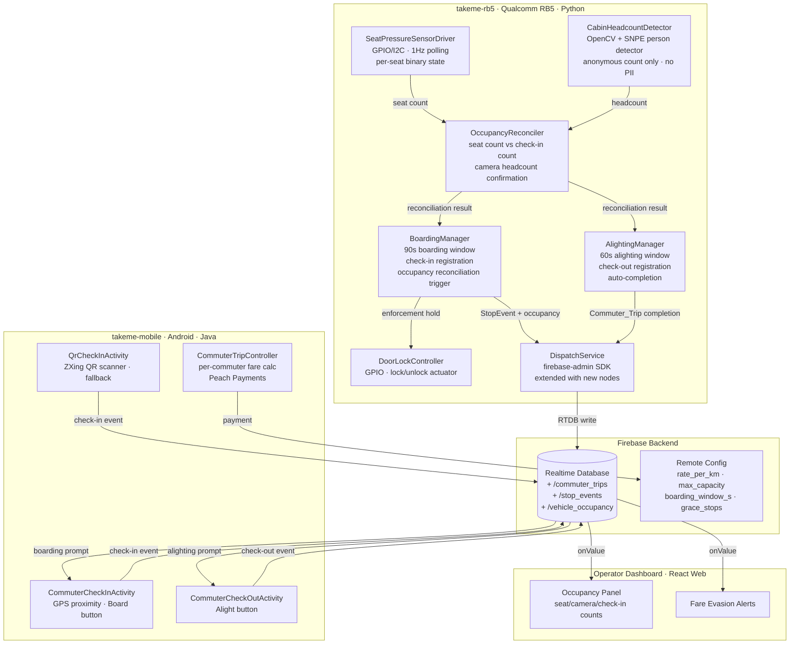

# Design Document: Multi-Commuter Boarding & Fare Enforcement

## Overview

This feature extends the TakeMe driverless minibus taxi system to support multiple concurrent commuters per vehicle. It adds app-based check-in/check-out, seat pressure sensor integration, anonymous camera headcount, occupancy reconciliation, fare evasion enforcement, and per-commuter trip lifecycle management.

The design spans both existing projects:

- **`takeme-rb5`** (Python, Qualcomm RB5) — gains new components: `BoardingManager`, `AlightingManager`, `OccupancyReconciler`, `SeatPressureSensorDriver`, `CabinHeadcountDetector`, and `DoorLockController`. These run on the vehicle and communicate with the Android app exclusively through Firebase RTDB.
- **`takeme-mobile`** (Java, Android) — gains new activities: `CommuterCheckInActivity`, `CommuterCheckOutActivity`, `QrCheckInActivity`, and a new `CommuterTripController` interface. The existing `TripController` and `PaymentActivity` are reused for per-commuter payment.

The existing Firebase RTDB schema is extended with new nodes: `/commuter_trips`, `/stop_events`, `/vehicle_occupancy`, and new fields on `/fleet_status`. The existing `/trips`, `/fleet_events`, `/pickup_requests` nodes are unchanged.

Key design constraints:
- No facial recognition or biometric storage (POPIA compliance)
- Camera headcount produces an integer count only — no identity extraction
- Seat pressure sensors are the ground-truth occupancy signal
- App-based check-in is voluntary; enforcement policy handles discrepancies
- QR code scan is a fallback check-in mechanism
- Door locks are controlled by the RB5 during enforcement holds

---

## Project Split

| Concern | Project | Language / Runtime |
|---|---|---|
| Seat pressure sensor driver | `takeme-rb5` | Python 3.11, GPIO/I2C via RB5 HAL |
| Cabin camera headcount | `takeme-rb5` | Python 3.11, OpenCV + SNPE person detector |
| Boarding/alighting window management | `takeme-rb5` | Python 3.11 |
| Occupancy reconciliation | `takeme-rb5` | Python 3.11 |
| Fare evasion enforcement policy | `takeme-rb5` | Python 3.11 |
| Door lock control | `takeme-rb5` | Python 3.11, GPIO |
| Vehicle occupancy state publishing | `takeme-rb5` | Python 3.11, firebase-admin SDK |
| Commuter check-in UI (app + QR) | `takeme-mobile` | Java, Android, ZXing (QR) |
| Commuter check-out UI | `takeme-mobile` | Java, Android |
| Per-commuter fare + payment | `takeme-mobile` | Java, Android, Peach Payments |
| Commuter trip history | `takeme-mobile` | Java, Android |
| Operator occupancy dashboard | Operator web app | React 18, Firebase JS SDK |

---

## Architecture



### Integration with Existing Components

The new components integrate with the existing `takeme-rb5` service loop:

1. **Existing `BoardingController`** (from hand signal spec) handles the initial 60s boarding confirmation for the first passenger who hailed. The new `BoardingManager` takes over after that confirmation, managing the multi-commuter boarding window.
2. **Existing `CameraFeedManager`** is reused. The `CabinHeadcountDetector` requests a single frame from a second camera device (`/dev/video1` — cabin-facing) or time-shares the existing camera during stops.
3. **Existing `DispatchService`** is extended with new methods for commuter trips, stop events, and occupancy state.
4. **Existing `RouteManager`** is extended with `routeToSafeStop()` for grace period escalation.

---

## Components and Interfaces

### `takeme-rb5` Python Components

### 1. SeatPressureSensorDriver

Interfaces with seat pressure sensors via GPIO/I2C on the RB5. Each sensor reports binary occupied/unoccupied.

```python
class SeatPressureSensorDriver:
    def __init__(self, seat_count: int):
        """Initialise driver for seat_count sensors."""

    def read_all(self) -> list[bool]:
        """Returns list of booleans, one per seat. True = occupied."""

    def get_occupied_count(self) -> int:
        """Returns number of currently occupied seats."""

    def get_faulty_sensors(self) -> list[int]:
        """Returns indices of sensors flagged as faulty (stuck > 60s)."""

    def flag_sensor_faulty(self, seat_index: int) -> None:
        """Manually flag a sensor as faulty, excluding it from count."""
```

### 2. CabinHeadcountDetector

Anonymous person count from cabin camera. Uses SNPE person detection model (same inference pipeline as hand signal detector). Produces count only — no identity.

```python
class CabinHeadcountDetector:
    def get_headcount(self) -> int:
        """Captures a frame from the cabin camera, runs person detection,
        returns integer count. No biometric data extracted (POPIA req 7.1)."""

    def is_available(self) -> bool:
        """Returns True if cabin camera is operational."""
```

### 3. OccupancyReconciler

Compares seat sensor count, camera headcount, and check-in count to produce a reconciliation result.

```python
@dataclass
class ReconciliationResult:
    seat_count: int
    camera_headcount: int
    checkin_count: int
    status: str  # "RECONCILED" | "DISCREPANCY_DETECTED"
    discrepancy: int  # seat_count - checkin_count (0 if reconciled)

class OccupancyReconciler:
    def reconcile_boarding(self, seat_count: int, checkin_count: int,
                           camera_headcount: int) -> ReconciliationResult:
        """Compares counts after boarding window closes.
        RECONCILED if seat_count <= checkin_count.
        DISCREPANCY_DETECTED if seat_count > checkin_count."""

    def reconcile_alighting(self, prev_seat_count: int, curr_seat_count: int,
                            checkout_count: int,
                            active_trips: list[dict]) -> tuple[str, list[str]]:
        """Compares seat decrease against check-outs.
        Returns (status, list of commuter_trip_ids to auto-complete)."""
```

### 4. BoardingManager

Orchestrates the boarding window, check-in registration, occupancy reconciliation, and enforcement policy.

```python
class BoardingManager:
    def __init__(self, sensor_driver: SeatPressureSensorDriver,
                 headcount_detector: CabinHeadcountDetector,
                 reconciler: OccupancyReconciler,
                 door_lock: DoorLockController,
                 dispatch: DispatchService,
                 max_capacity: int,
                 boarding_window_s: int = 90,
                 grace_stops: int = 2):
        ...

    def open_boarding_window(self, stop_lat: float, stop_lng: float) -> None:
        """Opens 90s boarding window. Accepts check-ins via Firebase listener."""

    def register_checkin(self, commuter_uid: str, stop_lat: float,
                         stop_lng: float, timestamp_ms: int) -> str:
        """Registers check-in. Returns commuter_trip_id.
        Rejects if duplicate or at max capacity."""

    def close_boarding_window(self) -> ReconciliationResult:
        """Closes window, triggers reconciliation, returns result."""

    def enforce_primary(self) -> None:
        """Holds vehicle, broadcasts prompt, re-opens window for 60s."""

    def enforce_fallback(self) -> None:
        """Departs with grace period. After grace_stops, routes to safe stop."""

    def on_grace_period_stop(self) -> ReconciliationResult:
        """Called at each stop during grace period. Re-checks reconciliation."""

    def get_occupancy_state(self) -> dict:
        """Returns current Vehicle_Occupancy_State for publishing."""

    def publish_occupancy_state(self) -> None:
        """Publishes to /vehicle_occupancy/{vehicleId} at ≤5s intervals."""
```

### 5. AlightingManager

Manages the alighting window, check-out registration, and auto-completion of trips for commuters who exit without checking out.

```python
class AlightingManager:
    def __init__(self, sensor_driver: SeatPressureSensorDriver,
                 reconciler: OccupancyReconciler,
                 dispatch: DispatchService,
                 alighting_window_s: int = 60):
        ...

    def open_alighting_window(self, stop_lat: float, stop_lng: float) -> None:
        """Opens 60s alighting window."""

    def register_checkout(self, commuter_trip_id: str,
                          stop_lat: float, stop_lng: float,
                          timestamp_ms: int) -> None:
        """Registers check-out, records alighting coordinates on Commuter_Trip."""

    def close_alighting_window(self) -> tuple[str, list[str]]:
        """Closes window, reconciles, returns (status, auto_completed_trip_ids)."""

    def auto_complete_trip(self, commuter_trip_id: str,
                           stop_lat: float, stop_lng: float) -> None:
        """Auto-completes trip using current stop. Triggers fare calc."""

    def calculate_commuter_fare(self, commuter_trip: dict,
                                 rate_per_km: float) -> float:
        """fare = distance_km * rate_per_km."""
```

### 6. DoorLockController

Controls the vehicle door lock actuator via GPIO.

```python
class DoorLockController:
    def lock(self) -> None:
        """Locks vehicle doors."""

    def unlock(self) -> None:
        """Unlocks vehicle doors."""

    def is_locked(self) -> bool:
        """Returns current lock state."""
```

### Extended DispatchService Methods

The existing `DispatchService` gains these new methods:

```python
# New methods on existing DispatchService class
class DispatchService:
    # ... existing methods ...

    def create_commuter_trip(self, commuter_trip: dict) -> None:
        """Writes to /commuter_trips/{commuterTripId}."""

    def update_commuter_trip(self, commuter_trip: dict) -> None:
        """Updates /commuter_trips/{commuterTripId}."""

    def write_stop_event(self, stop_event: dict) -> None:
        """Writes to /stop_events/{stopEventId}. Retained 30 days."""

    def publish_vehicle_occupancy(self, vehicle_id: str, state: dict) -> None:
        """Writes to /vehicle_occupancy/{vehicleId}."""

    def publish_fare_evasion_alert(self, alert: dict) -> None:
        """Writes FleetEvent(FARE_EVASION_ALERT) to /fleet_events."""

    def publish_fare_evasion_resolved(self, vehicle_id: str,
                                       stop_event_id: str) -> None:
        """Writes FleetEvent(FARE_EVASION_RESOLVED) to /fleet_events."""

    def publish_sensor_failure(self, vehicle_id: str,
                                seat_index: int) -> None:
        """Writes FleetEvent(SENSOR_FAILURE) to /fleet_events."""
```

### Extended RouteManager Methods

```python
class RouteManager:
    # ... existing methods ...

    def route_to_safe_stop(self, current_lat: float, current_lng: float) -> tuple[float, float]:
        """Calculates route to nearest Safe_Stop. Returns (lat, lng)."""
```

---

### `takeme-mobile` Android Components

### 7. CommuterTripController

New interface for per-commuter trip lifecycle on the Android side.

```java
public interface CommuterTripController {
    /**
     * Registers check-in by writing to /commuter_trips/{id} with status BOARDING.
     * Validates GPS proximity (≤30m from vehicle).
     * Rejects duplicate check-ins for same vehicle.
     */
    void checkIn(String vehicleId, double stopLat, double stopLng);

    /**
     * Registers check-out by updating /commuter_trips/{id} with alighting coords.
     * Triggers fare calculation.
     */
    void checkOut(String commuterTripId, double stopLat, double stopLng);

    /**
     * Calculates per-commuter fare: distance_km * rate_per_km.
     * Reuses existing rate_per_km from Remote Config.
     */
    Fare calculateCommuterFare(double distanceKm, String currencyCode);

    /**
     * Processes payment for a Commuter_Trip via Peach Payments.
     * Retry up to 3 times with exponential backoff.
     */
    void processCommuterPayment(CommuterTrip trip, boolean paymentSuccess);
}
```

### 8. CommuterCheckInActivity

New Android activity for the "Board" button. Checks GPS proximity to a stopped vehicle, writes check-in to Firebase RTDB.

```java
public class CommuterCheckInActivity extends AppCompatActivity {
    // Listens on /vehicle_occupancy/{vehicleId}/boardingWindowOpen
    // Shows "Board" button when within 30m of stopped vehicle
    // On tap: writes check-in to /commuter_trips/{id}
    // Handles duplicate rejection, capacity full notification
}
```

### 9. QrCheckInActivity

New Android activity for QR code fallback check-in. Uses ZXing library to scan vehicle-specific QR code.

```java
public class QrCheckInActivity extends AppCompatActivity {
    // Launches ZXing scanner
    // Decodes vehicleId from QR payload
    // Writes check-in identically to CommuterCheckInActivity
}
```

### 10. CommuterCheckOutActivity

New Android activity for the "Alight" button.

```java
public class CommuterCheckOutActivity extends AppCompatActivity {
    // Shows "Alight" button when vehicle is stopped
    // On tap: writes check-out to /commuter_trips/{id}
    // Shows fare and triggers payment flow via CommuterTripController
}
```

---

## Data Models

### CommuterTrip

```java
public class CommuterTrip {
    private String commuterTripId;       // UUID
    private String vehicleId;
    private String commuterUid;          // Firebase Auth UID
    private double boardingLat;
    private double boardingLng;
    private long boardingTimestampMs;
    private double alightingLat;
    private double alightingLng;
    private long alightingTimestampMs;
    private double distanceKm;
    private double fareAmount;
    private String currency;             // "ZAR" default
    private String status;               // "BOARDING" | "IN_TRANSIT" | "COMPLETED" | "PAYMENT_FAILED"
    private String paymentStatus;        // "PENDING" | "PAID" | "FAILED" | "FLAGGED"
    private int paymentAttempts;         // 0–3
    private boolean autoCompleted;       // true if commuter exited without check-out
    private String checkinMethod;        // "APP" | "QR_CODE"
    private String stopEventId;          // reference to boarding StopEvent
}
```

### StopEvent

```java
public class StopEvent {
    private String stopEventId;          // UUID
    private String vehicleId;
    private double stopLat;
    private double stopLng;
    private long timestampMs;
    private List<String> checkinIds;     // list of commuterTripIds checked in
    private List<String> checkoutIds;    // list of commuterTripIds checked out
    private int seatCount;               // seat sensor count at window close
    private int cameraHeadcount;         // camera count at window close
    private int checkinCount;            // number of check-ins during window
    private String reconciliationStatus; // "RECONCILED" | "DISCREPANCY_DETECTED"
    private String enforcementAction;    // "NONE" | "PRIMARY_HOLD" | "GRACE_PERIOD" | "SAFE_STOP_ROUTE"
}
```

### VehicleOccupancyState

```java
public class VehicleOccupancyState {
    private String vehicleId;
    private int seatSensorCount;
    private int cameraHeadcount;
    private int checkedInCount;
    private int activeCommuterTrips;
    private int maxCapacity;
    private boolean boardingWindowOpen;
    private boolean alightingWindowOpen;
    private int gracePeriodStopsRemaining; // 0 = no grace period active
    private long timestampMs;
}
```

### Extended FleetEvent Types

The existing `FleetEvent.FleetEventType` enum gains new values:

```java
public enum FleetEventType {
    // ... existing values ...
    CAMERA_FAILURE,
    PICKUP_CANCELLED,
    OBSTACLE_ABORT,
    FP_RATE_ALERT,
    PAYMENT_FAILURE,
    FPS_WARNING,
    INFERENCE_ERROR,
    TRIP_CREATE_ERROR,
    // New for multi-commuter
    FARE_EVASION_ALERT,
    FARE_EVASION_RESOLVED,
    SENSOR_FAILURE
}
```

### Firebase RTDB Schema Extensions

New nodes added alongside the existing schema:

```
/commuter_trips/{commuterTripId}
    vehicleId            : string
    commuterUid          : string        // Firebase Auth UID
    boardingLat          : double
    boardingLng          : double
    boardingTimestampMs  : long
    alightingLat         : double
    alightingLng         : double
    alightingTimestampMs : long
    distanceKm           : double
    fareAmount           : double
    currency             : string        // "ZAR"
    status               : string        // "BOARDING" | "IN_TRANSIT" | "COMPLETED" | "PAYMENT_FAILED"
    paymentStatus        : string        // "PENDING" | "PAID" | "FAILED" | "FLAGGED"
    paymentAttempts      : int
    autoCompleted        : boolean
    checkinMethod        : string        // "APP" | "QR_CODE"
    stopEventId          : string

/stop_events/{stopEventId}               // retained 30 days
    vehicleId            : string
    stopLat              : double
    stopLng              : double
    timestampMs          : long
    checkinIds           : list<string>
    checkoutIds          : list<string>
    seatCount            : int
    cameraHeadcount      : int
    checkinCount         : int
    reconciliationStatus : string        // "RECONCILED" | "DISCREPANCY_DETECTED"
    enforcementAction    : string        // "NONE" | "PRIMARY_HOLD" | "GRACE_PERIOD" | "SAFE_STOP_ROUTE"

/vehicle_occupancy/{vehicleId}
    seatSensorCount      : int
    cameraHeadcount      : int
    checkedInCount       : int
    activeCommuterTrips  : int
    maxCapacity          : int
    boardingWindowOpen   : boolean
    alightingWindowOpen  : boolean
    gracePeriodStopsRemaining : int
    timestampMs          : long          // ServerValue.TIMESTAMP

/fleet_status/{vehicleId}
    // Existing fields unchanged, plus:
    occupancyDiscrepancy : boolean       // true if unresolved discrepancy
    gracePeriodActive    : boolean
```

### Firebase Security Rules (new nodes)

```json
{
  "rules": {
    "commuter_trips": {
      "$tripId": {
        ".read": "auth != null && (data.child('commuterUid').val() === auth.uid || auth.token.operator === true)",
        ".write": "auth != null"
      }
    },
    "stop_events": {
      ".read": "auth.token.operator === true",
      ".write": "auth != null"
    },
    "vehicle_occupancy": {
      "$vehicleId": {
        ".read": "auth != null",
        ".write": "auth.uid === $vehicleId || auth.token.operator === true"
      }
    }
  }
}
```

### Firebase Remote Config Keys (new)

| Key | Default | Description |
|---|---|---|
| `max_capacity` | `15` | Maximum commuter capacity per vehicle |
| `boarding_window_s` | `90` | Boarding window duration in seconds |
| `alighting_window_s` | `60` | Alighting window duration in seconds |
| `enforcement_reopen_s` | `60` | Re-opened boarding window during primary enforcement |
| `grace_period_stops` | `2` | Number of stops before escalation to safe stop |


---

## Correctness Properties

*A property is a characteristic or behavior that should hold true across all valid executions of a system — essentially, a formal statement about what the system should do. Properties serve as the bridge between human-readable specifications and machine-verifiable correctness guarantees.*

---

### Property 1: Check-In Creates Complete Commuter_Trip and Updates Occupancy

*For any* valid commuter UID, vehicle ID, and stop coordinates, when `BoardingManager.register_checkin()` is called during an open boarding window, the resulting `Commuter_Trip` must contain the commuter UID, boarding GPS coordinates, and a positive boarding timestamp. The `Vehicle_Occupancy_State` active trip list must grow by exactly one, and the checked-in count must increment by one.

**Validates: Requirements 1.1.1, 1.1.2, 1.1.3**

---

### Property 2: Duplicate Check-In Rejection

*For any* commuter UID that is already checked in on a given vehicle, a second call to `BoardingManager.register_checkin()` with the same commuter UID and vehicle ID must be rejected (return an error/null), and the `Vehicle_Occupancy_State` active trip list and checked-in count must remain unchanged.

**Validates: Requirements 1.1.4**

---

### Property 3: QR Code Check-In Equivalence

*For any* commuter UID and vehicle ID, a check-in registered via QR code scan must produce a `Commuter_Trip` with identical fields (UID, boarding GPS, boarding timestamp, vehicle ID) to one registered via the app-based "Board" button, differing only in the `checkinMethod` field ("QR_CODE" vs "APP").

**Validates: Requirements 1.2.2, 1.2.3**

---

### Property 4: Boarding Window Acceptance Gate

*For any* check-in attempt, `BoardingManager.register_checkin()` must succeed if and only if the boarding window is currently open. When the boarding window is closed, all check-in attempts must be rejected.

**Validates: Requirements 1.3.2, 1.3.3**

---

### Property 5: StopEvent Data Completeness on Window Close

*For any* boarding window closure, the resulting `StopEvent` must contain non-null stop GPS coordinates, a positive timestamp, and a `checkinIds` list whose length equals the number of check-ins registered during that window. The `seatCount` and `reconciliationStatus` fields must be non-null.

**Validates: Requirements 1.3.4, 6.2.1**

---

### Property 6: Seat Count Invariant

*For any* sequence of seat pressure sensor transitions (occupied ↔ unoccupied), the `Vehicle_Occupancy_State.seatSensorCount` must equal the number of sensors currently reporting occupied. The seat count must be a non-negative integer at all times — it must never go below zero regardless of the transition sequence.

**Validates: Requirements 2.1.2, 2.1.3, 2.1.4**

---

### Property 7: Occupancy Reconciliation Correctness

*For any* non-negative integers `seatCount` and `checkinCount`, `OccupancyReconciler.reconcile_boarding()` must return `RECONCILED` when `seatCount <= checkinCount`, and `DISCREPANCY_DETECTED` when `seatCount > checkinCount`. The `discrepancy` field must equal `max(0, seatCount - checkinCount)`.

**Validates: Requirements 2.3.1, 2.3.2, 2.3.3**

---

### Property 8: Primary Enforcement — Discrepancy Prevents Departure

*For any* `ReconciliationResult` with status `DISCREPANCY_DETECTED`, the `BoardingManager` must set departure permission to `false`, re-open the boarding window for the configured enforcement duration, and only permit departure when a subsequent reconciliation returns `RECONCILED`.

**Validates: Requirements 3.1.1, 3.1.3, 3.1.4**

---

### Property 9: Fallback Enforcement — Grace Period Lifecycle

*For any* unresolved discrepancy after primary enforcement, the `BoardingManager` must enter a grace period with `gracePeriodStopsRemaining` set to the configured value (default 2). At each subsequent stop, if a late check-in resolves the discrepancy, the grace period must be cancelled (`gracePeriodStopsRemaining = 0`). If the grace period expires (reaches 0 without resolution), `RouteManager.route_to_safe_stop()` must be called.

**Validates: Requirements 3.2.1, 3.2.3, 3.2.4**

---

### Property 10: Fare Evasion Alert Completeness

*For any* `DISCREPANCY_DETECTED` reconciliation result, `DispatchService.publish_fare_evasion_alert()` must be called with a payload containing non-null `vehicleId`, non-null stop GPS coordinates, a positive `timestampMs`, and integer values for `seatCount`, `checkinCount`, and `cameraHeadcount`. When the discrepancy is later resolved, `DispatchService.publish_fare_evasion_resolved()` must be called.

**Validates: Requirements 3.3.1, 3.3.3, 3.3.4**

---

### Property 11: Door Lock State Consistency

*For any* vehicle state transition, the door lock state must satisfy: doors are unlocked when the vehicle is stopped at a stop (including during enforcement holds), and doors are locked when the vehicle departs. Formally: `is_locked() == false` when vehicle is at a stop, and `is_locked() == true` when vehicle is in motion.

**Validates: Requirements 3.4.1, 3.4.2, 3.4.3**

---

### Property 12: Check-Out Completes Commuter_Trip and Updates Occupancy

*For any* active `Commuter_Trip` and valid alighting coordinates, when `AlightingManager.register_checkout()` is called during an open alighting window, the `Commuter_Trip` must be updated with non-null alighting GPS coordinates and a positive alighting timestamp. The trip must be removed from the `Vehicle_Occupancy_State` active trip list (list shrinks by one), and fare calculation must be triggered.

**Validates: Requirements 4.1.1, 4.1.2, 4.1.3, 4.1.4**

---

### Property 13: Alighting Reconciliation and Auto-Completion

*For any* alighting window closure where the seat count decrease exceeds the check-out count, the `OccupancyReconciler` must identify the commuter trips that were not checked out. For each identified trip, `AlightingManager.auto_complete_trip()` must be called with the current stop coordinates, the `Commuter_Trip.autoCompleted` flag must be set to `true`, and fare calculation must be triggered using the current stop as the alighting point.

**Validates: Requirements 4.3.1, 4.3.2, 4.3.3, 4.3.4, 5.3.1, 5.3.3**

---

### Property 14: Per-Commuter Fare Calculation

*For any* non-negative `distanceKm` and positive `ratePerKm`, `AlightingManager.calculate_commuter_fare()` must return `distanceKm * ratePerKm` (within floating-point epsilon). This must hold for both normal check-out and auto-completed trips.

**Validates: Requirements 5.1.1, 5.1.2, 5.1.4**

---

### Property 15: Commuter Payment Lifecycle

*For any* completed `Commuter_Trip`, when payment succeeds, the trip must have `paymentStatus == PAID` and `status == COMPLETED`. When all 3 payment attempts fail, the trip must have `paymentStatus == FLAGGED` and `status == PAYMENT_FAILED`, and a `PAYMENT_FAILURE` fleet event must be published containing the `commuterTripId`. The total number of payment API calls must never exceed 3 for a single trip.

**Validates: Requirements 5.2.2, 5.2.3, 5.2.4**

---

### Property 16: Vehicle Occupancy State Data Completeness

*For any* published `VehicleOccupancyState`, the record must contain non-negative integer values for `seatSensorCount`, `cameraHeadcount`, `checkedInCount`, and `activeCommuterTrips`, plus a positive `maxCapacity` and a positive `timestampMs`.

**Validates: Requirements 6.1.2**

---

### Property 17: Completed Commuter_Trip Data Completeness

*For any* `Commuter_Trip` with `status == COMPLETED`, the stored record must contain non-null values for `commuterUid`, `boardingLat`, `boardingLng`, `alightingLat`, `alightingLng`, `distanceKm` (≥ 0), `fareAmount` (≥ 0), `paymentStatus`, and `autoCompleted` flag.

**Validates: Requirements 6.3.1**

---

### Property 18: Camera Headcount Privacy — No PII in Output

*For any* call to `CabinHeadcountDetector.get_headcount()`, the return value must be a non-negative integer. The method must not return, store, or transmit any object containing image bytes, facial feature vectors, biometric data, or commuter-identifying information.

**Validates: Requirements 2.2.3, 7.1.1, 7.1.2, 7.1.3**

---

### Property 19: Faulty Sensor Exclusion

*For any* seat pressure sensor that reports a stuck reading (same value) for more than 60 seconds, the sensor must be flagged as faulty and excluded from the `seatSensorCount`. A `SENSOR_FAILURE` fleet event must be published containing the `vehicleId` and `seatIndex`. While faulty sensors exist, `OccupancyReconciler` must use `cameraHeadcount` as the primary occupancy signal instead of `seatSensorCount`.

**Validates: Requirements 7.2.1, 7.2.2, 7.2.3**

---

### Property 20: Concurrent Boarding/Alighting — Check-Outs Before Check-Ins

*For any* stop where both check-outs and check-ins occur, the `BoardingManager` must process all check-outs before processing any check-ins. The net occupancy reconciliation must verify that `newSeatCount == previousSeatCount - checkoutCount + checkinCount` matches the physical seat sensor count. A single `StopEvent` must be created containing both the check-out list and the check-in list.

**Validates: Requirements 7.3.1, 7.3.2, 7.3.3**

---

### Property 21: Capacity Enforcement

*For any* vehicle where `checkedInCount == maxCapacity`, all subsequent `BoardingManager.register_checkin()` calls must be rejected. When capacity is reached during an open boarding window, the window must close early and departure must be permitted.

**Validates: Requirements 8.1.1, 8.1.2, 8.1.3**

---

## Error Handling

### Seat Pressure Sensor Errors (`takeme-rb5`)

- Sensor stuck (same reading > 60s): flagged as faulty via `SeatPressureSensorDriver.flag_sensor_faulty()`; excluded from count; `FleetEvent(SENSOR_FAILURE)` published
- All sensors faulty: `OccupancyReconciler` falls back to `CabinHeadcountDetector` as sole occupancy signal
- Sensor I2C communication failure: caught in `read_all()`; sensor treated as faulty; logged

### Cabin Camera Errors (`takeme-rb5`)

- Camera unavailable: `CabinHeadcountDetector.is_available()` returns `false`; `OccupancyReconciler` uses seat sensor count only; logged as warning
- Person detection model failure: returns headcount of -1 (sentinel); reconciler ignores camera signal for that window

### Boarding/Alighting Window Errors

- Firebase listener disconnection during window: window continues locally on RB5; events buffered and flushed on reconnect
- Check-in write failure to RTDB: retry with exponential backoff (3 attempts); if all fail, log `CHECKIN_WRITE_ERROR` fleet event
- Duplicate check-in race condition: Firebase transaction used to atomically check-and-write; second write rejected

### Door Lock Errors (`takeme-rb5`)

- GPIO communication failure: `DoorLockController` logs error; vehicle defaults to unlocked state (fail-safe — passengers can always exit)
- Lock actuator stuck: detected by read-back check; `FleetEvent(DOOR_LOCK_FAILURE)` published; vehicle flagged for inspection

### Enforcement Policy Errors

- Grace period stop count tracking lost (RB5 restart): grace period state persisted to local file; restored on restart
- Safe stop routing failure (no safe stop found): vehicle continues to next regular stop; operator alerted

### Payment Errors (reuses existing pattern)

- Peach Payments API error: retry up to 3 times with exponential backoff (1s, 2s, 4s)
- After 3 failures: `paymentStatus = FLAGGED`; `FleetEvent(PAYMENT_FAILURE)` published
- Network unavailable: queue payment; process on connectivity restore

### QR Code Errors (`takeme-mobile`)

- Invalid QR code scanned (not a TakeMe vehicle QR): app shows error message; no check-in registered
- QR code for different vehicle than nearby: app validates vehicleId against nearby vehicles via GPS; rejects if no match within 30m

---

## Testing Strategy

### Dual Testing Approach

Both unit tests and property-based tests are required. They are complementary:
- Unit tests catch concrete bugs with specific inputs and verify integration points
- Property tests verify universal correctness across thousands of generated inputs

### `takeme-rb5` — Property-Based Testing with Hypothesis

**Library:** Hypothesis 6.x with pytest

Each of the 21 correctness properties above must be implemented as a single `@given` test in `tests/test_multi_commuter_properties.py`.

Each property test must be tagged with a comment:
```python
# Feature: multi-commuter-boarding-fare-enforcement, Property N: <property_text>
```

**Minimum 100 iterations per property test** (Hypothesis default is 100; configure via `@settings(max_examples=100)` or higher).

**Hypothesis strategies needed:**

```python
from hypothesis import given, settings, strategies as st

commuter_uid_strategy = st.text(min_size=1, max_size=28, alphabet=st.characters(whitelist_categories=('L', 'N')))
vehicle_id_strategy = st.text(min_size=1, max_size=20, alphabet=st.characters(whitelist_categories=('L', 'N')))
gps_lat_strategy = st.floats(min_value=-90.0, max_value=90.0, allow_nan=False, allow_infinity=False)
gps_lng_strategy = st.floats(min_value=-180.0, max_value=180.0, allow_nan=False, allow_infinity=False)
timestamp_strategy = st.integers(min_value=1, max_value=2**53)
seat_count_strategy = st.integers(min_value=0, max_value=30)
checkin_count_strategy = st.integers(min_value=0, max_value=30)
distance_strategy = st.floats(min_value=0.0, max_value=500.0, allow_nan=False, allow_infinity=False)
rate_strategy = st.floats(min_value=0.01, max_value=100.0, allow_nan=False, allow_infinity=False)
capacity_strategy = st.integers(min_value=1, max_value=30)

commuter_trip_strategy = st.fixed_dictionaries({
    "commuter_trip_id": st.uuids().map(str),
    "vehicle_id": vehicle_id_strategy,
    "commuter_uid": commuter_uid_strategy,
    "boarding_lat": gps_lat_strategy,
    "boarding_lng": gps_lng_strategy,
    "boarding_timestamp_ms": timestamp_strategy,
})

sensor_readings_strategy = st.lists(st.booleans(), min_size=1, max_size=30)
```

**Example property test (Property 7 — Reconciliation Correctness):**

```python
# Feature: multi-commuter-boarding-fare-enforcement, Property 7: Occupancy reconciliation correctness
@given(
    seat_count=seat_count_strategy,
    checkin_count=checkin_count_strategy,
    camera_headcount=seat_count_strategy,
)
@settings(max_examples=200)
def test_reconciliation_correctness(seat_count, checkin_count, camera_headcount):
    reconciler = OccupancyReconciler()
    result = reconciler.reconcile_boarding(seat_count, checkin_count, camera_headcount)

    if seat_count <= checkin_count:
        assert result.status == "RECONCILED"
        assert result.discrepancy == 0
    else:
        assert result.status == "DISCREPANCY_DETECTED"
        assert result.discrepancy == seat_count - checkin_count
```

**Example property test (Property 14 — Fare Calculation):**

```python
# Feature: multi-commuter-boarding-fare-enforcement, Property 14: Per-commuter fare calculation
@given(
    distance_km=distance_strategy,
    rate_per_km=rate_strategy,
)
@settings(max_examples=200)
def test_commuter_fare_calculation(distance_km, rate_per_km):
    manager = AlightingManager(sensor_driver=mock_sensor, reconciler=mock_reconciler,
                                dispatch=mock_dispatch)
    fare = manager.calculate_commuter_fare({"distance_km": distance_km}, rate_per_km)
    assert abs(fare - distance_km * rate_per_km) < 1e-9
```

### `takeme-rb5` — Unit Tests (pytest + unittest.mock)

| Test Module | Covers |
|---|---|
| `test_seat_pressure_sensor` | Sensor read, faulty detection at 60s boundary, exclusion from count |
| `test_cabin_headcount` | Returns int, camera unavailable returns -1, no PII in output |
| `test_boarding_manager` | 90s window open/close, duplicate rejection, capacity full, enforcement flow |
| `test_alighting_manager` | 60s window, check-out registration, auto-completion, fare trigger |
| `test_occupancy_reconciler` | Exact boundary: seat==checkin, seat>checkin, seat<checkin, faulty sensor fallback |
| `test_door_lock_controller` | Lock/unlock state transitions, fail-safe to unlocked |
| `test_enforcement_flow` | Primary hold → re-open → resolve, grace period countdown, safe stop routing |
| `test_dispatch_extensions` | Commuter trip CRUD, stop event write, fare evasion alert payload |

### `takeme-mobile` — Android Testing (JUnit 4 + jqwik + Espresso)

**Property-based testing library:** jqwik 1.8.x (same as existing spec)

Each Android-side property must be implemented as a single `@Property` test tagged with:
```java
// Feature: multi-commuter-boarding-fare-enforcement, Property N: <property_text>
```

**jqwik dependency (already in build.gradle from previous spec):**
```groovy
testImplementation 'net.jqwik:jqwik:1.8.1'
testImplementation 'org.mockito:mockito-core:4.11.0'
```

**New dependency for QR scanning:**
```groovy
implementation 'com.journeyapps:zxing-android-embedded:4.3.0'
```

**Android unit tests:**

| Test Class | Covers |
|---|---|
| `CommuterTripControllerTest` | Check-in/check-out, fare calc, payment retry, duplicate rejection |
| `CommuterCheckInActivityTest` | GPS proximity validation (30m boundary), capacity full UI |
| `QrCheckInActivityTest` | Valid QR decode, invalid QR rejection, vehicle ID mismatch |
| `CommuterCheckOutActivityTest` | Alight button state, fare presentation |

**Espresso integration tests:**

| Test Class | Covers |
|---|---|
| `MultiCommuterBoardingFlowTest` | Full boarding flow: check-in → occupancy update → boarding window close |
| `CommuterAlightingFlowTest` | Check-out → fare display → payment → trip completed |
| `QrFallbackFlowTest` | QR scan → check-in registered → same as app flow |

### Property Test Configuration

**`takeme-rb5/requirements.txt` (test extras):**
```
pytest>=7.4
hypothesis>=6.100
pytest-mock>=3.12
```

**`takeme-mobile/app/build.gradle` (test extras):**
```groovy
testImplementation 'net.jqwik:jqwik:1.8.1'
testImplementation 'org.mockito:mockito-core:4.11.0'
testImplementation 'org.assertj:assertj-core:3.24.2'
```
